<!-- AUTO-GENERATED by grove. Do not edit. Run `grove render` to refresh. -->

# Development dashboard

## Content health

| Measure | Count | Composition |
| --- | --- | --- |
| C (content) | 12 | validated B 2 · answered Q 0 · accepted D 4 · active Discovery 6 |
| V (uncertainty) | 4 | open Q 0 · pending B 0 · W below DoR 0 · uncovered surface 4 |

## Areas

| Area | Title | C (content) | V (uncertainty) | Composition |
| --- | --- | --- | --- | --- |
| A-01 | Content pipeline | 0 | 1 | C: validated B 0 · answered Q 0 · accepted D 0; V: open Q 0 · pending B 0 · W below DoR 0 · uncovered surface 1 |
| A-02 | Pages and routing | 0 | 0 | C: validated B 0 · answered Q 0 · accepted D 0; V: open Q 0 · pending B 0 · W below DoR 0 |
| A-03 | Interface and theming | 0 | 2 | C: validated B 0 · answered Q 0 · accepted D 0; V: open Q 0 · pending B 0 · W below DoR 0 · uncovered surface 2 |
| A-04 | Site services | 0 | 0 | C: validated B 0 · answered Q 0 · accepted D 0; V: open Q 0 · pending B 0 · W below DoR 0 |
| A-05 | Toolchain and delivery | 2 | 1 | C: validated B 0 · answered Q 0 · accepted D 0 · active Discovery 2; V: open Q 0 · pending B 0 · W below DoR 0 · uncovered surface 1 |

> Relevance view, not a partition: a node touching two areas counts in both; a W without goals counts in none. The Content health totals above are primary.

## Goals

| ID | Outcome | Fitness function | Status |
| --- | --- | --- | --- |
| G-06 | Toolchain conventions follow the review refinements | count; current=1 target=2 | partial |
| G-07 | Icon delivery and code styles follow the review refinements | count; current= target=2 | unverified |
| G-08 | Taxonomy grouping is unified | count; current= target=1 | unverified |

## Work items

| ID | Type | Title | Goals | Cynefin | DoR | Status | Critical |
| --- | --- | --- | --- | --- | --- | --- | --- |
| W-01 | spike | Verify Astro 7 baseline on Bun (scaffold, content probe, dev and build) | G-01, G-05 | complex | ⊤ | done |  |
| W-14 | refactor | Adopt reviewed toolchain conventions (target output, public static, unified icons, text lockfile, no postcssrc, no baseUrl) | G-06 | clear | ⊤ | done |  |
| W-15 | refactor | Prefer arrow functions across pages and scripts | G-06 | clear | ⊤ | proposed | ★ |
| W-16 | refactor | Replace prism styles with shiki oriented code styles | G-07 | clear | ⊤ | proposed |  |
| W-17 | refactor | Serve icons through an svg sprite | G-07 | complicated | ⊤ | proposed |  |
| W-18 | refactor | Unify taxonomy grouping behind one helper | G-08 | clear | ⊤ | proposed |  |

## Decisions

| ID | Title | Status | Supersedes |
| --- | --- | --- | --- |
| D-07 | Static output only | accepted |  |
| D-08 | Bun stays the package manager and script runner | accepted |  |
| D-09 | Semantic versioning pipeline stays unchanged | accepted |  |
| D-10 | Flat islands directory replaces the components tree | accepted |  |

## Assumptions

| ID | Assumption | Tests | Targets | Status |
| --- | --- | --- | --- | --- |
| B-02 | Bun drives the Astro 7 toolchain |  | W-01 | validated |
| B-06 | Manual getStaticPaths emits the bare-first-plus-page-N URL set |  | W-06 | validated |

## Themes

| ID | Title | Status | Causes work | Themed work |
| --- | --- | --- | --- | --- |
| T-02 | Post-migration review findings | open | W-14, W-15, W-16, W-17, W-18 | W-14, W-15, W-16, W-17, W-18 |

## Discoveries

| ID | Title | Tags | Status |
| --- | --- | --- | --- |
| Y-01 | Vite CSS modules must mirror webpack camelCase exports | css-modules, vite | active |
| Y-02 | Astro 7 needs explicit unified markdown setup | sätteri | active |
| Y-03 | Content layer images optimize only through render | content-layer | active |
| Y-04 | Port gatsby pagination as zero-based manual paths | pagination | active |
| Y-05 | Render feed content through the container API | content-layer | active |
| Y-06 | Freeze a reference build for migration parity gates | Parity | active |

## Dependency graph

```mermaid
graph TD
  G_06["G-06: Toolchain conventions follow the review refinements"]:::goal
  G_07["G-07: Icon delivery and code styles follow the review refinements"]:::goal
  G_08["G-08: Taxonomy grouping is unified"]:::goal
  W_01["W-01: Verify Astro 7 baseline on Bun (scaffold, content probe, dev and build)"]:::spike
  W_14["W-14: Adopt reviewed toolchain conventions (target output, public static, unified icons, text lockfile, no postcssrc, no baseUrl)"]:::done
  W_15["W-15: Prefer arrow functions across pages and scripts"]:::feature,critical
  W_16["W-16: Replace prism styles with shiki oriented code styles"]:::feature
  W_17["W-17: Serve icons through an svg sprite"]:::feature
  W_18["W-18: Unify taxonomy grouping behind one helper"]:::feature
  D_07["D-07: Static output only"]:::decision
  D_08["D-08: Bun stays the package manager and script runner"]:::decision
  D_09["D-09: Semantic versioning pipeline stays unchanged"]:::decision
  D_10["D-10: Flat islands directory replaces the components tree"]:::decision
  B_02["B-02: Bun drives the Astro 7 toolchain"]:::assumption
  B_06["B-06: Manual getStaticPaths emits the bare-first-plus-page-N URL set"]:::assumption
  T_02["T-02: Post-migration review findings"]:::theme
  Y_01["Y-01: Vite CSS modules must mirror webpack camelCase exports"]:::discovery
  Y_02["Y-02: Astro 7 needs explicit unified markdown setup"]:::discovery
  Y_03["Y-03: Content layer images optimize only through render"]:::discovery
  Y_04["Y-04: Port gatsby pagination as zero-based manual paths"]:::discovery
  Y_05["Y-05: Render feed content through the container API"]:::discovery
  Y_06["Y-06: Freeze a reference build for migration parity gates"]:::discovery
  A_01["A-01: Content pipeline"]:::area
  A_02["A-02: Pages and routing"]:::area
  A_03["A-03: Interface and theming"]:::area
  A_04["A-04: Site services"]:::area
  A_05["A-05: Toolchain and delivery"]:::area
  B_01 -.->|targets| W_02
  B_02 -.->|targets| W_01
  B_03 -.->|targets| W_10
  B_04 -.->|targets| W_03
  B_05 -.->|targets| W_06
  B_06 -.->|targets| W_06
  D_12 -->|supersedes| D_11
  Q_01 -->|asks| W_05
  Q_01 -->|asks| W_06
  Q_02 -->|asks| W_11
  Q_03 -->|asks| W_10
  T_01 -->|causes| W_13
  T_02 -->|causes| W_14
  T_02 -->|causes| W_15
  T_02 -->|causes| W_16
  T_02 -->|causes| W_17
  T_02 -->|causes| W_18
  W_01 ==>|blocks| W_02
  W_01 ==>|blocks| W_03
  W_01 -->|implements| D_07
  W_01 -->|implements| D_08
  W_01 -->|produces| B_06
  W_02 ==>|blocks| W_05
  W_02 ==>|blocks| W_06
  W_02 ==>|blocks| W_07
  W_02 ==>|blocks| W_08
  W_02 ==>|blocks| W_09
  W_02 -->|implements| D_05
  W_03 ==>|blocks| W_04
  W_03 ==>|blocks| W_05
  W_03 -->|implements| D_03
  W_04 ==>|blocks| W_05
  W_04 ==>|blocks| W_11
  W_04 -->|implements| D_02
  W_04 -->|implements| D_10
  W_05 ==>|blocks| W_11
  W_05 ==>|blocks| W_12
  W_05 -->|implements| D_10
  W_06 ==>|blocks| W_12
  W_06 -->|implements| D_06
  W_06 -->|produces| Y_04
  W_07 ==>|blocks| W_05
  W_07 -->|implements| D_04
  W_07 -->|produces| Y_02
  W_08 ==>|blocks| W_05
  W_08 -->|produces| Y_03
  W_09 ==>|blocks| W_12
  W_09 -->|produces| Y_05
  W_10 ==>|blocks| W_12
  W_11 ==>|blocks| W_13
  W_12 ==>|blocks| W_13
  W_12 -->|produces| Y_06
  W_13 -->|implements| D_01
  W_13 -->|implements| D_11
  W_13 -->|implements| D_12
  Y_01 -->|distills| B_04
  class W_15 critical
classDef area fill:#5a1e4a,color:#fff
classDef goal fill:#1e3a5f,color:#fff
classDef theme fill:#2a4a3a,color:#fff
classDef decision fill:#5a4a1e,color:#fff
classDef question fill:#5a3a1e,color:#fff
classDef assumption fill:#4a2d5a,color:#fff
classDef spike fill:#3a3a5a,color:#fff
classDef feature fill:#1e4a4a,color:#fff
classDef ready fill:#2d5a27,color:#fff
classDef progress fill:#3a4a6a,color:#fff,stroke:#fff,stroke-width:2px
classDef done fill:#2d5a27,color:#fff,stroke:#fff,stroke-width:2px
classDef rejected fill:#5a5a5a,color:#fff
classDef discovery fill:#1f4e5f,color:#fff
classDef critical stroke:#ff0,stroke-width:3px
```

