<!-- AUTO-GENERATED by grove. Do not edit. Run `grove render` to refresh. -->

# Development dashboard

## Content health

| Measure | Count | Composition |
| --- | --- | --- |
| C (content) | 53 | validated B 2 · answered Q 3 · accepted D 8 · active Discovery 40 |
| V (uncertainty) | 0 | open Q 0 · pending B 0 · W below DoR 0 |

## Areas

| Area | Title | C (content) | V (uncertainty) | Composition |
| --- | --- | --- | --- | --- |
| A-01 | Content pipeline | 2 | 0 | C: validated B 0 · answered Q 0 · accepted D 0 · active Discovery 2; V: open Q 0 · pending B 0 · W below DoR 0 |
| A-02 | Pages and routing | 2 | 0 | C: validated B 0 · answered Q 0 · accepted D 0 · active Discovery 2; V: open Q 0 · pending B 0 · W below DoR 0 |
| A-03 | Interface and theming | 1 | 0 | C: validated B 0 · answered Q 0 · accepted D 0 · active Discovery 1; V: open Q 0 · pending B 0 · W below DoR 0 |
| A-04 | Site services | 1 | 0 | C: validated B 0 · answered Q 0 · accepted D 0 · active Discovery 1; V: open Q 0 · pending B 0 · W below DoR 0 |
| A-05 | Toolchain and delivery | 4 | 0 | C: validated B 0 · answered Q 0 · accepted D 0 · active Discovery 4; V: open Q 0 · pending B 0 · W below DoR 0 |
| A-06 | Semantics and discoverability | 0 | 0 | C: validated B 0 · answered Q 0 · accepted D 0; V: open Q 0 · pending B 0 · W below DoR 0 |
| A-07 | Documentation | 2 | 0 | C: validated B 0 · answered Q 0 · accepted D 0 · active Discovery 2; V: open Q 0 · pending B 0 · W below DoR 0 |
| A-08 | Reading experience | 0 | 0 | C: validated B 0 · answered Q 0 · accepted D 0; V: open Q 0 · pending B 0 · W below DoR 0 |

> Relevance view, not a partition: a node touching two areas counts in both; a W without goals counts in none. The Content health totals above are primary.

## Decisions

| ID | Title | Status | Supersedes |
| --- | --- | --- | --- |
| D-07 | Static output only | accepted |  |
| D-08 | Bun stays the package manager and script runner | accepted |  |
| D-09 | Semantic versioning pipeline stays unchanged | accepted |  |
| D-10 | Flat islands directory replaces the components tree | accepted |  |
| D-25 | Reading time joins the breadcrumb trail line | superseded |  |
| D-27 | Reading time as a nav sibling on the breadcrumb line | accepted | D-25 |
| D-28 | Data-nosnippet chrome contract | superseded |  |
| D-29 | Sidebar section with its own hidden heading | superseded |  |
| D-30 | Aside wrapper with the nosnippet div kept | superseded | D-28 |
| D-32 | Sidebar heading Overview | accepted | D-29 |
| D-33 | Toolbar aside labelled Reader controls | accepted | D-30 |
| D-40 | Commit grammar anchors on any grove node id | accepted | D-12 |

## Open questions

| ID | Question | Cynefin | Targets | Status |
| --- | --- | --- | --- | --- |
| Q-04 | Does the content layer expose raw markdown body for the full-text corpus? | complicated |  | answered |
| Q-05 | Default social card image when a post has none | complicated |  | answered |
| Q-07 | Do audits or tests assert stylesheet values? | complicated |  | answered |

## Assumptions

| ID | Assumption | Tests | Targets | Status |
| --- | --- | --- | --- | --- |
| B-02 | Bun drives the Astro 7 toolchain |  | W-01 | validated |
| B-06 | Manual getStaticPaths emits the bare-first-plus-page-N URL set |  | W-06 | validated |

## Themes

| ID | Title | Status | Causes work | Themed work |
| --- | --- | --- | --- | --- |
| T-02 | Post-migration review findings | open | W-14, W-15, W-16, W-17, W-18, W-19, W-20, W-21, W-22, W-23, W-24, W-25, W-26, W-27, W-28, W-29, W-30, W-31, W-32, W-33, W-34, W-35, W-36, W-37, W-38, W-39, W-40, W-41, W-42, W-43, W-44, W-45, W-46, W-47, W-48, W-49, W-50, W-82 | – |
| T-04 | Semantic polish of remaining generic wrappers | open | W-105, W-106, W-107, W-108, W-109, W-110, W-111, W-112, W-113, W-115, W-117, W-118, W-119, W-120, W-121, W-122, W-123, W-124, W-126, W-128, W-129, W-130 | – |

## Discoveries

| ID | Title | Tags | Status |
| --- | --- | --- | --- |
| Y-01 | Vite CSS modules must mirror webpack camelCase exports | css-modules, vite | active |
| Y-02 | Astro 7 needs explicit unified markdown setup | sätteri | active |
| Y-03 | Content layer images optimize only through render | content-layer | active |
| Y-04 | Port gatsby pagination as zero-based manual paths | pagination | active |
| Y-05 | Render feed content through the container API | content-layer | active |
| Y-06 | Freeze a reference build for migration parity gates | parity | active |
| Y-07 | Own rehype image pipeline replaces content layer images | content-layer | active |
| Y-08 | Attribute sized images need the canonical height auto pair | parity | active |
| Y-09 | Semantic tag swaps keep pixels only with box-model parity | css-modules, parity | active |
| Y-10 | Graph ids are urls whose fragments ground in visible DOM | graph-anchor, json-ld | active |
| Y-11 | LLM surface is plain-text endpoints excluded from the sitemap | content-layer, llms | active |
| Y-12 | Semantics audits must be pure functions over parsed input | graph-anchor, semantics-audit | active |
| Y-13 | Head completeness is feed, article and theming metas plus visible agent links | head-groups, llms | active |
| Y-14 | Internal links must land on named slices | graph-anchor, link-grammar | active |
| Y-15 | In-page navigation is an anchored SiteNavigationElement | graph-anchor, json-ld, toc | superseded |
| Y-16 | Social cards are generated at build from page metadata | social-card | active |
| Y-17 | Breadcrumb placement is contextual and CSS-only | breadcrumb | active |
| Y-18 | Floating chrome rides absolute rails with sticky children | toc | superseded |
| Y-19 | Breadcrumb nav carries slotted notes beside the trail | breadcrumb | superseded |
| Y-20 | Page chrome renders before main and inherits the flow it replaces | post-toolbar | active |
| Y-21 | Meta line groups the trail nav and sibling notes | breadcrumb | active |
| Y-22 | Boilerplate chrome opts out of snippets and keeps its box | post-toolbar | superseded |
| Y-23 | Regions name themselves through hidden scoped headings | sidebar | superseded |
| Y-24 | Nosnippet rides div span or section inside named wrappers | post-toolbar | active |
| Y-25 | Machine surface links live in a right-aligned footer inside main | sidebar | superseded |
| Y-26 | Static sweeps must cover non-index html files | link-grammar | active |
| Y-27 | Composite regions carry a maintainer-chosen umbrella heading | sidebar | active |
| Y-28 | Article owns the semantics and wrappers stay transparent | css-modules | active |
| Y-29 | Feed headers own their headings and gaps come from mixins | css-modules | active |
| Y-30 | DOM labels and graph names share one constant source | graph-anchor | active |
| Y-31 | Bare header and footer wrappers inside a scoped section are landmark-free and geometry-neutral | scoped-wrapper | active |
| Y-32 | The content column lives in per-element rules, not a wrapper | content-column | active |
| Y-33 | Toc removal is invisible to flow and graph audits | toc | active |
| Y-34 | CSS icon sprite paints shape-only SVGs through masks | css-icon-sprite | active |
| Y-35 | Icons center on trimmed text boxes, not line boxes | css-icon-sprite | active |
| Y-36 | Post markdown ships beside its page as a text alternate | llms | active |
| Y-37 | Content lists carry their markers in a flex column | content-column | active |
| Y-38 | Sizes and spacing live on named rem scales, not leading arithmetic | leading-arithmetic, rem-token-scale | active |
| Y-39 | Commits and branches carry grove node ids | commit-grammar | active |
| Y-40 | Linked crumb urls match the visible breadcrumb hrefs | breadcrumb, link-grammar | active |
| Y-41 | Site chrome anchors to the website through isPartOf | graph-anchor, json-ld | active |
| Y-42 | Frontmatter owns graph dates and http contact urls | frontmatter, graph-anchor | active |
| Y-43 | Contributors table excludes the repository owner | contributors-table | active |
| Y-44 | Sponsors stay a GFM table with an unpadded delimiter row | sponsors-table | active |
| Y-45 | Analytics renders only when configured | analytics-guard | active |
| Y-46 | Wire optional integrations only when their credential resolves | credential-gate | active |
| Y-47 | v.Nu false-flags valid modern CSS | vnu-css-lag | proposed |
| Y-48 | pathLength must sit on path for validator-clean SVG | pathlength-on-path | proposed |

## Dependency graph

```mermaid
graph TD
  D_07["D-07: Static output only"]:::decision
  D_08["D-08: Bun stays the package manager and script runner"]:::decision
  D_09["D-09: Semantic versioning pipeline stays unchanged"]:::decision
  D_10["D-10: Flat islands directory replaces the components tree"]:::decision
  D_25["D-25: Reading time joins the breadcrumb trail line"]:::decision
  D_27["D-27: Reading time as a nav sibling on the breadcrumb line"]:::decision
  D_28["D-28: Data-nosnippet chrome contract"]:::decision
  D_29["D-29: Sidebar section with its own hidden heading"]:::decision
  D_30["D-30: Aside wrapper with the nosnippet div kept"]:::decision
  D_32["D-32: Sidebar heading Overview"]:::decision
  D_33["D-33: Toolbar aside labelled Reader controls"]:::decision
  D_40["D-40: Commit grammar anchors on any grove node id"]:::decision
  Q_04["Q-04: Does the content layer expose raw markdown body for the full-text corpus?"]:::question
  Q_05["Q-05: Default social card image when a post has none"]:::question
  Q_07["Q-07: Do audits or tests assert stylesheet values?"]:::question
  B_02["B-02: Bun drives the Astro 7 toolchain"]:::assumption
  B_06["B-06: Manual getStaticPaths emits the bare-first-plus-page-N URL set"]:::assumption
  T_02["T-02: Post-migration review findings"]:::theme
  T_04["T-04: Semantic polish of remaining generic wrappers"]:::theme
  Y_01["Y-01: Vite CSS modules must mirror webpack camelCase exports"]:::discovery
  Y_02["Y-02: Astro 7 needs explicit unified markdown setup"]:::discovery
  Y_03["Y-03: Content layer images optimize only through render"]:::discovery
  Y_04["Y-04: Port gatsby pagination as zero-based manual paths"]:::discovery
  Y_05["Y-05: Render feed content through the container API"]:::discovery
  Y_06["Y-06: Freeze a reference build for migration parity gates"]:::discovery
  Y_07["Y-07: Own rehype image pipeline replaces content layer images"]:::discovery
  Y_08["Y-08: Attribute sized images need the canonical height auto pair"]:::discovery
  Y_09["Y-09: Semantic tag swaps keep pixels only with box-model parity"]:::discovery
  Y_10["Y-10: Graph ids are urls whose fragments ground in visible DOM"]:::discovery
  Y_11["Y-11: LLM surface is plain-text endpoints excluded from the sitemap"]:::discovery
  Y_12["Y-12: Semantics audits must be pure functions over parsed input"]:::discovery
  Y_13["Y-13: Head completeness is feed, article and theming metas plus visible agent links"]:::discovery
  Y_14["Y-14: Internal links must land on named slices"]:::discovery
  Y_15["Y-15: In-page navigation is an anchored SiteNavigationElement"]:::discovery
  Y_16["Y-16: Social cards are generated at build from page metadata"]:::discovery
  Y_17["Y-17: Breadcrumb placement is contextual and CSS-only"]:::discovery
  Y_18["Y-18: Floating chrome rides absolute rails with sticky children"]:::discovery
  Y_19["Y-19: Breadcrumb nav carries slotted notes beside the trail"]:::discovery
  Y_20["Y-20: Page chrome renders before main and inherits the flow it replaces"]:::discovery
  Y_21["Y-21: Meta line groups the trail nav and sibling notes"]:::discovery
  Y_22["Y-22: Boilerplate chrome opts out of snippets and keeps its box"]:::discovery
  Y_23["Y-23: Regions name themselves through hidden scoped headings"]:::discovery
  Y_24["Y-24: Nosnippet rides div span or section inside named wrappers"]:::discovery
  Y_25["Y-25: Machine surface links live in a right-aligned footer inside main"]:::discovery
  Y_26["Y-26: Static sweeps must cover non-index html files"]:::discovery
  Y_27["Y-27: Composite regions carry a maintainer-chosen umbrella heading"]:::discovery
  Y_28["Y-28: Article owns the semantics and wrappers stay transparent"]:::discovery
  Y_29["Y-29: Feed headers own their headings and gaps come from mixins"]:::discovery
  Y_30["Y-30: DOM labels and graph names share one constant source"]:::discovery
  Y_31["Y-31: Bare header and footer wrappers inside a scoped section are landmark-free and geometry-neutral"]:::discovery
  Y_32["Y-32: The content column lives in per-element rules, not a wrapper"]:::discovery
  Y_33["Y-33: Toc removal is invisible to flow and graph audits"]:::discovery
  Y_34["Y-34: CSS icon sprite paints shape-only SVGs through masks"]:::discovery
  Y_35["Y-35: Icons center on trimmed text boxes, not line boxes"]:::discovery
  Y_36["Y-36: Post markdown ships beside its page as a text alternate"]:::discovery
  Y_37["Y-37: Content lists carry their markers in a flex column"]:::discovery
  Y_38["Y-38: Sizes and spacing live on named rem scales, not leading arithmetic"]:::discovery
  Y_39["Y-39: Commits and branches carry grove node ids"]:::discovery
  Y_40["Y-40: Linked crumb urls match the visible breadcrumb hrefs"]:::discovery
  Y_41["Y-41: Site chrome anchors to the website through isPartOf"]:::discovery
  Y_42["Y-42: Frontmatter owns graph dates and http contact urls"]:::discovery
  Y_43["Y-43: Contributors table excludes the repository owner"]:::discovery
  Y_44["Y-44: Sponsors stay a GFM table with an unpadded delimiter row"]:::discovery
  Y_45["Y-45: Analytics renders only when configured"]:::discovery
  Y_46["Y-46: Wire optional integrations only when their credential resolves"]:::discovery
  Y_47["Y-47: v.Nu false-flags valid modern CSS"]:::discovery
  Y_48["Y-48: pathLength must sit on path for validator-clean SVG"]:::discovery
  A_01["A-01: Content pipeline"]:::area
  A_02["A-02: Pages and routing"]:::area
  A_03["A-03: Interface and theming"]:::area
  A_04["A-04: Site services"]:::area
  A_05["A-05: Toolchain and delivery"]:::area
  A_06["A-06: Semantics and discoverability"]:::area
  A_07["A-07: Documentation"]:::area
  A_08["A-08: Reading experience"]:::area
  B_01 -.->|targets| W_02
  B_02 -.->|targets| W_01
  B_03 -.->|targets| W_10
  B_04 -.->|targets| W_03
  B_05 -.->|targets| W_06
  B_06 -.->|targets| W_06
  B_07 -.->|targets| W_51
  B_08 -.->|targets| W_86
  B_08 -.->|targets| W_87
  B_09 -.->|targets| W_89
  B_10 -.->|targets| W_90
  B_11 -.->|targets| W_90
  B_12 -.->|targets| W_91
  B_13 -.->|targets| W_92
  B_14 -.->|targets| W_92
  B_15 -.->|targets| W_93
  B_16 -.->|targets| W_94
  B_17 -.->|targets| W_95
  B_18 -.->|targets| W_96
  B_19 -.->|targets| W_97
  B_20 -.->|targets| W_101
  B_21 -.->|targets| W_102
  B_22 -.->|targets| W_103
  B_23 -.->|targets| W_105
  B_24 -.->|targets| W_105
  B_25 -.->|targets| W_106
  B_26 -.->|targets| W_106
  B_27 -.->|targets| W_107
  B_28 -.->|targets| W_107
  B_29 -.->|targets| W_108
  B_30 -.->|targets| W_108
  B_31 -.->|targets| W_109
  B_32 -.->|targets| W_109
  B_33 -.->|targets| W_110
  B_34 -.->|targets| W_110
  B_35 -.->|targets| W_111
  B_36 -.->|targets| W_111
  B_37 -.->|targets| W_112
  B_38 -.->|targets| W_113
  B_39 -.->|targets| W_113
  B_40 -.->|targets| W_114
  B_41 -.->|targets| W_114
  B_42 -.->|targets| W_115
  B_43 -.->|targets| W_115
  B_44 -.->|targets| W_116
  B_45 -.->|targets| W_117
  B_46 -.->|targets| W_118
  B_47 -.->|targets| W_119
  B_48 -.->|targets| W_120
  B_49 -.->|targets| W_121
  B_50 -.->|targets| W_123
  B_51 -.->|targets| W_124
  B_52 -.->|targets| W_125
  B_53 -.->|targets| W_125
  B_54 -.->|targets| W_126
  B_55 -.->|targets| W_127
  B_56 -.->|targets| W_128
  B_57 -.->|targets| W_129
  B_58 -.->|targets| W_130
  B_59 -.->|targets| W_132
  B_59 -.->|targets| W_133
  B_59 -.->|targets| W_134
  B_59 -->|tests| Q_08
  D_12 -->|supersedes| D_11
  D_27 -->|supersedes| D_25
  D_30 -->|supersedes| D_28
  D_32 -->|supersedes| D_29
  D_33 -->|supersedes| D_30
  D_37 -->|supersedes| D_21
  D_40 -->|supersedes| D_12
  D_42 -->|supersedes| D_41
  D_44 -->|supersedes| D_43
  Q_01 -->|asks| W_05
  Q_01 -->|asks| W_06
  Q_02 -->|asks| W_11
  Q_03 -->|asks| W_10
  Q_06 -->|asks| W_79
  Q_08 -->|asks| W_132
  T_01 -->|causes| W_13
  T_02 -->|causes| W_14
  T_02 -->|causes| W_15
  T_02 -->|causes| W_16
  T_02 -->|causes| W_17
  T_02 -->|causes| W_18
  T_02 -->|causes| W_19
  T_02 -->|causes| W_20
  T_02 -->|causes| W_21
  T_02 -->|causes| W_22
  T_02 -->|causes| W_23
  T_02 -->|causes| W_24
  T_02 -->|causes| W_25
  T_02 -->|causes| W_26
  T_02 -->|causes| W_27
  T_02 -->|causes| W_28
  T_02 -->|causes| W_29
  T_02 -->|causes| W_30
  T_02 -->|causes| W_31
  T_02 -->|causes| W_32
  T_02 -->|causes| W_33
  T_02 -->|causes| W_34
  T_02 -->|causes| W_35
  T_02 -->|causes| W_36
  T_02 -->|causes| W_37
  T_02 -->|causes| W_38
  T_02 -->|causes| W_39
  T_02 -->|causes| W_40
  T_02 -->|causes| W_41
  T_02 -->|causes| W_42
  T_02 -->|causes| W_43
  T_02 -->|causes| W_44
  T_02 -->|causes| W_45
  T_02 -->|causes| W_46
  T_02 -->|causes| W_47
  T_02 -->|causes| W_48
  T_02 -->|causes| W_49
  T_02 -->|causes| W_50
  T_02 -->|causes| W_82
  T_03 -->|causes| W_51
  T_03 -->|causes| W_52
  T_03 -->|causes| W_53
  T_03 -->|causes| W_54
  T_03 -->|causes| W_55
  T_03 -->|causes| W_56
  T_04 -->|causes| W_105
  T_04 -->|causes| W_106
  T_04 -->|causes| W_107
  T_04 -->|causes| W_108
  T_04 -->|causes| W_109
  T_04 -->|causes| W_110
  T_04 -->|causes| W_111
  T_04 -->|causes| W_112
  T_04 -->|causes| W_113
  T_04 -->|causes| W_115
  T_04 -->|causes| W_117
  T_04 -->|causes| W_118
  T_04 -->|causes| W_119
  T_04 -->|causes| W_120
  T_04 -->|causes| W_121
  T_04 -->|causes| W_122
  T_04 -->|causes| W_123
  T_04 -->|causes| W_124
  T_04 -->|causes| W_126
  T_04 -->|causes| W_128
  T_04 -->|causes| W_129
  T_04 -->|causes| W_130
  T_05 -->|causes| W_104
  W_01 ==>|blocks| W_02
  W_01 ==>|blocks| W_03
  W_01 -->|implements| D_07
  W_01 -->|implements| D_08
  W_01 -->|produces| B_06
  W_02 ==>|blocks| W_05
  W_02 ==>|blocks| W_06
  W_02 ==>|blocks| W_07
  W_02 ==>|blocks| W_08
  W_02 ==>|blocks| W_09
  W_02 -->|implements| D_05
  W_03 ==>|blocks| W_04
  W_03 ==>|blocks| W_05
  W_03 -->|implements| D_03
  W_04 ==>|blocks| W_05
  W_04 ==>|blocks| W_11
  W_04 -->|implements| D_02
  W_04 -->|implements| D_10
  W_05 ==>|blocks| W_11
  W_05 ==>|blocks| W_12
  W_05 -->|implements| D_10
  W_06 ==>|blocks| W_12
  W_06 -->|implements| D_06
  W_06 -->|produces| Y_04
  W_07 ==>|blocks| W_05
  W_07 -->|implements| D_04
  W_07 -->|produces| Y_02
  W_08 ==>|blocks| W_05
  W_08 -->|produces| Y_03
  W_09 ==>|blocks| W_12
  W_09 -->|produces| Y_05
  W_10 ==>|blocks| W_12
  W_100 -->|implements| D_33
  W_101 -->|implements| D_34
  W_102 -->|implements| D_35
  W_103 -->|implements| D_36
  W_104 -->|produces| Y_30
  W_11 ==>|blocks| W_13
  W_12 ==>|blocks| W_13
  W_12 -->|produces| Y_06
  W_13 -->|implements| D_01
  W_13 -->|implements| D_11
  W_13 -->|implements| D_12
  W_131 ==>|blocks| W_132
  W_131 -->|implements| D_38
  W_132 ==>|blocks| W_133
  W_132 -->|implements| D_38
  W_133 ==>|blocks| W_134
  W_133 -->|implements| D_38
  W_134 ==>|blocks| W_135
  W_134 -->|implements| D_38
  W_134 -->|implements| D_39
  W_135 -->|implements| D_39
  W_136 -->|produces| Y_40
  W_137 -->|produces| Y_41
  W_138 -->|produces| Y_41
  W_139 -->|produces| Y_42
  W_140 -->|produces| Y_42
  W_142 -->|implements| D_41
  W_143 -->|implements| D_42
  W_144 -->|implements| D_43
  W_146 -->|implements| D_44
  W_149 -->|implements| D_45
  W_150 -->|implements| D_46
  W_150 -->|implements| D_47
  W_153 -->|produces| Y_48
  W_154 -->|produces| Y_47
  W_32 -->|produces| D_13
  W_47 -->|produces| Y_07
  W_50 -->|produces| Y_08
  W_51 ==>|blocks| W_52
  W_51 ==>|blocks| W_53
  W_51 ==>|blocks| W_54
  W_51 ==>|blocks| W_55
  W_51 ==>|blocks| W_56
  W_51 -->|implements| D_14
  W_52 ==>|blocks| W_70
  W_52 -->|implements| D_14
  W_53 ==>|blocks| W_59
  W_53 ==>|blocks| W_70
  W_53 -->|implements| D_14
  W_54 ==>|blocks| W_60
  W_54 ==>|blocks| W_70
  W_54 -->|implements| D_14
  W_55 ==>|blocks| W_61
  W_55 ==>|blocks| W_70
  W_55 -->|implements| D_14
  W_56 ==>|blocks| W_62
  W_56 ==>|blocks| W_70
  W_56 -->|implements| D_14
  W_57 ==>|blocks| W_58
  W_57 -->|implements| D_15
  W_58 ==>|blocks| W_59
  W_58 ==>|blocks| W_60
  W_58 ==>|blocks| W_61
  W_58 ==>|blocks| W_62
  W_58 ==>|blocks| W_68
  W_58 -->|implements| D_15
  W_59 ==>|blocks| W_68
  W_59 -->|implements| D_15
  W_60 -->|implements| D_15
  W_61 -->|implements| D_15
  W_62 -->|implements| D_15
  W_63 ==>|blocks| W_64
  W_63 -->|implements| D_16
  W_64 -->|implements| D_16
  W_65 ==>|blocks| W_67
  W_65 -->|implements| D_17
  W_66 ==>|blocks| W_67
  W_66 -->|implements| D_17
  W_67 -->|implements| D_17
  W_68 ==>|blocks| W_69
  W_68 ==>|blocks| W_71
  W_68 ==>|blocks| W_72
  W_68 -->|implements| D_18
  W_69 ==>|blocks| W_71
  W_69 ==>|blocks| W_72
  W_69 -->|implements| D_18
  W_70 ==>|blocks| W_71
  W_70 ==>|blocks| W_72
  W_70 -->|implements| D_18
  W_71 -->|implements| D_18
  W_72 -->|implements| D_18
  W_73 -->|implements| D_19
  W_74 -->|implements| D_19
  W_75 -->|implements| D_19
  W_76 ==>|blocks| W_77
  W_76 -->|implements| D_20
  W_77 ==>|blocks| W_78
  W_77 -->|implements| D_20
  W_79 ==>|blocks| W_80
  W_79 -->|implements| D_21
  W_80 -->|implements| D_21
  W_81 -->|implements| D_21
  W_85 ==>|blocks| W_86
  W_85 -->|produces| B_08
  W_86 ==>|blocks| W_87
  W_86 -->|implements| D_22
  W_87 -->|implements| D_22
  W_89 -->|implements| D_23
  W_90 -->|implements| D_24
  W_91 -->|implements| D_25
  W_92 -->|implements| D_26
  W_93 -->|implements| D_27
  W_94 -->|implements| D_28
  W_95 -->|implements| D_29
  W_96 -->|implements| D_30
  W_97 -->|implements| D_31
  W_98 -->|produces| Y_26
  W_99 -->|implements| D_32
  Y_01 -->|distills| B_04
  Y_09 -->|distills| B_07
  Y_10 -->|distills| D_15
  Y_11 -->|distills| D_17
  Y_12 -->|distills| D_18
  Y_13 -->|distills| D_19
  Y_14 -->|distills| D_20
  Y_15 -->|distills| D_21
  Y_16 -->|distills| D_22
  Y_17 -->|distills| D_23
  Y_18 -->|distills| D_24
  Y_19 -->|distills| D_25
  Y_20 -->|distills| D_26
  Y_21 -->|distills| D_27
  Y_22 -->|distills| D_28
  Y_23 -->|distills| D_29
  Y_24 -->|distills| D_33
  Y_25 -->|distills| D_31
  Y_27 -->|distills| D_32
  Y_28 -->|distills| D_34
  Y_29 -->|distills| D_35
  Y_31 -->|distills| B_23
  Y_31 -->|distills| B_24
  Y_32 -->|distills| B_25
  Y_32 -->|distills| B_26
  Y_33 -->|distills| B_27
  Y_33 -->|distills| B_28
  Y_33 -->|supersedes| Y_18
  Y_34 -->|distills| B_40
  Y_34 -->|distills| B_41
  Y_35 -->|distills| B_42
  Y_35 -->|distills| B_43
  Y_36 -->|distills| B_47
  Y_37 -->|distills| B_52
  Y_37 -->|distills| B_53
  Y_38 -->|distills| D_38
  Y_38 -->|distills| D_39
  Y_39 -->|distills| D_12
  Y_39 -->|distills| D_40
  Y_41 -->|supersedes| Y_15
  Y_43 -->|distills| D_42
  Y_44 -->|distills| D_44
  Y_45 -->|distills| D_45
  Y_46 -->|distills| D_47
classDef area fill:#5a1e4a,color:#fff
classDef goal fill:#1e3a5f,color:#fff
classDef theme fill:#2a4a3a,color:#fff
classDef decision fill:#5a4a1e,color:#fff
classDef question fill:#5a3a1e,color:#fff
classDef assumption fill:#4a2d5a,color:#fff
classDef spike fill:#3a3a5a,color:#fff
classDef feature fill:#1e4a4a,color:#fff
classDef ready fill:#2d5a27,color:#fff
classDef progress fill:#3a4a6a,color:#fff,stroke:#fff,stroke-width:2px
classDef done fill:#2d5a27,color:#fff,stroke:#fff,stroke-width:2px
classDef rejected fill:#5a5a5a,color:#fff
classDef discovery fill:#1f4e5f,color:#fff
classDef critical stroke:#ff0,stroke-width:3px
```

