<!-- AUTO-GENERATED by grove. Do not edit. Run `grove render` to refresh. -->

# Development dashboard

## Content health

| Measure | Count | Composition |
| --- | --- | --- |
| C (content) | 17 | validated B 4 · answered Q 3 · accepted D 9 · active Discovery 1 |
| V (uncertainty) | 11 | open Q 0 · pending B 1 · W below DoR 1 · uncovered surface 9 |
| Decay | 1 | Discovery with decay signals |

## Areas

| Area | Title | C (content) | V (uncertainty) | Composition |
| --- | --- | --- | --- | --- |
| A-01 | Content pipeline | 7 | 2 | C: validated B 3 · answered Q 0 · accepted D 3 · active Discovery 1; V: open Q 0 · pending B 0 · W below DoR 0 · uncovered surface 2 |
| A-02 | Pages and routing | 4 | 2 | C: validated B 1 · answered Q 1 · accepted D 2; V: open Q 0 · pending B 0 · W below DoR 0 · uncovered surface 2 |
| A-03 | Interface and theming | 5 | 0 | C: validated B 1 · answered Q 0 · accepted D 3 · active Discovery 1; V: open Q 0 · pending B 0 · W below DoR 0 |
| A-04 | Site services | 1 | 4 | C: validated B 0 · answered Q 1 · accepted D 0; V: open Q 0 · pending B 1 · W below DoR 1 · uncovered surface 2 |
| A-05 | Toolchain and delivery | 7 | 3 | C: validated B 2 · answered Q 1 · accepted D 3 · active Discovery 1; V: open Q 0 · pending B 0 · W below DoR 0 · uncovered surface 3 |

> Relevance view, not a partition: a node touching two areas counts in both; a W without goals counts in none. The Content health totals above are primary.

## Goals

| ID | Outcome | Fitness function | Status |
| --- | --- | --- | --- |
| G-01 | Content pipeline runs on Astro with rendering parity | count; current=1 target=3 | partial |
| G-02 | All public routes keep their Gatsby URL shapes on Astro | count; current= target=2 | unverified |
| G-03 | Interface and theming match the current site on Astro | count; current=2 target=2 | verified |
| G-04 | Site services are restored (feed, sitemap, manifest, analytics, error tracking) | count; current= target=2 | unverified |
| G-05 | Delivery pipeline runs on Astro (tests, parity verification, cleanup) | count; current=0 target=3 | unverified |

## Work items

| ID | Type | Title | Goals | Cynefin | DoR | Status | Critical |
| --- | --- | --- | --- | --- | --- | --- | --- |
| W-01 | spike | Verify Astro 7 baseline on Bun (scaffold, content probe, dev and build) | G-01, G-05 | complex | ⊤ | done |  |
| W-02 | feature | Port content to Astro content collections (posts, pages, site config) | G-01 | complicated | ⊤ | done |  |
| W-03 | feature | Port global styles and theme switching (SCSS pipeline, palettes, no-FOUC script) | G-03 | complicated | ⊤ | done |  |
| W-04 | feature | Port UI components to flat Astro islands (sidebar, feed, post, pagination, icons) | G-03 | complicated | ⊤ | done |  |
| W-05 | feature | Port core templates with URL parity (index, post, page, 404, meta) | G-02 | complicated | ⊤ | ready | ★ |
| W-06 | feature | Port taxonomy listings with pagination (categories, tags, years, /page/N) | G-02 | complicated | ⊤ | ready |  |
| W-07 | feature | Reach markdown rendering parity (autolinks, smartypants, external links, copy files, iframes, code highlighting) | G-01 | complicated | ⊤ | ready | ★ |
| W-08 | feature | Port the image pipeline to astro:assets (webp, responsive sizes, social images) | G-01 | complicated | ⊤ | ready |  |
| W-09 | feature | Restore site services (rss.xml, sitemap, manifest) | G-04 | clear | ⊤ | ready |  |
| W-10 | feature | Restore analytics and error tracking (gtag, Sentry) | G-04 | clear | ⊥ | proposed |  |
| W-11 | feature | Reduce the test suite to logic tests on bun test (drop React snapshots) | G-05 | complicated | ⊤ | proposed | ★ |
| W-12 | feature | Verify parity against the Gatsby build (routes, HTML, screenshots) | G-05 | complicated | ⊤ | proposed |  |
| W-13 | refactor | Remove Gatsby and close out tooling (deps, scripts, CI, docs) | G-05 | clear | ⊤ | proposed | ★ |

## Decisions

| ID | Title | Status | Supersedes |
| --- | --- | --- | --- |
| D-01 | Migrate to Astro 7 | accepted |  |
| D-02 | Native Astro components without React runtime | accepted |  |
| D-03 | Vanilla theme state replaces diesel | accepted |  |
| D-04 | Shiki replaces PrismJS for code highlighting | proposed |  |
| D-05 | Content collections replace GraphQL sourcing | accepted |  |
| D-06 | URL parity including page pagination paths | accepted |  |
| D-07 | Static output only | accepted |  |
| D-08 | Bun stays the package manager and script runner | accepted |  |
| D-09 | Semantic versioning pipeline stays unchanged | accepted |  |
| D-10 | Flat islands directory replaces the components tree | accepted |  |

## Open questions

| ID | Question | Cynefin | Targets | Status |
| --- | --- | --- | --- | --- |
| Q-01 | How strict must URL parity be? | complicated | W-05, W-06 | answered |
| Q-02 | Which test strategy replaces the React component tests? | complicated | W-11 | answered |
| Q-03 | Which third-party services stay (Google Analytics, Sentry)? | clear | W-10 | answered |

## Assumptions

| ID | Assumption | Tests | Targets | Status |
| --- | --- | --- | --- | --- |
| B-01 | Astro 7 content collections cover the lumen frontmatter |  | W-02 | validated |
| B-02 | Bun drives the Astro 7 toolchain |  | W-01 | validated |
| B-03 | The Sentry Astro SDK supports Astro 7 |  | W-10 | proposed |
| B-04 | Existing SCSS compiles under Vite with minimal changes |  | W-03 | validated |
| B-05 | paginate() supports the Gatsby /page/N path shape |  | W-06 | invalidated_acceptable |
| B-06 | Manual getStaticPaths emits the bare-first-plus-page-N URL set |  | W-06 | validated |

## Themes

| ID | Title | Status | Causes work | Themed work |
| --- | --- | --- | --- | --- |
| T-01 | Legacy Gatsby platform constraints | open | W-13 | W-13 |

## Discoveries

| ID | Title | Tags | Status |
| --- | --- | --- | --- |
| Y-01 | Vite CSS modules must mirror webpack camelCase exports | css-modules, vite | active |

## Dependency graph

```mermaid
graph TD
  G_01["G-01: Content pipeline runs on Astro with rendering parity"]:::goal
  G_02["G-02: All public routes keep their Gatsby URL shapes on Astro"]:::goal
  G_03["G-03: Interface and theming match the current site on Astro"]:::goal
  G_04["G-04: Site services are restored (feed, sitemap, manifest, analytics, error tracking)"]:::goal
  G_05["G-05: Delivery pipeline runs on Astro (tests, parity verification, cleanup)"]:::goal
  W_01["W-01: Verify Astro 7 baseline on Bun (scaffold, content probe, dev and build)"]:::spike
  W_02["W-02: Port content to Astro content collections (posts, pages, site config)"]:::done
  W_03["W-03: Port global styles and theme switching (SCSS pipeline, palettes, no-FOUC script)"]:::done
  W_04["W-04: Port UI components to flat Astro islands (sidebar, feed, post, pagination, icons)"]:::done
  W_05["W-05: Port core templates with URL parity (index, post, page, 404, meta)"]:::ready,critical
  W_06["W-06: Port taxonomy listings with pagination (categories, tags, years, /page/N)"]:::ready
  W_07["W-07: Reach markdown rendering parity (autolinks, smartypants, external links, copy files, iframes, code highlighting)"]:::ready,critical
  W_08["W-08: Port the image pipeline to astro:assets (webp, responsive sizes, social images)"]:::ready
  W_09["W-09: Restore site services (rss.xml, sitemap, manifest)"]:::ready
  W_10["W-10: Restore analytics and error tracking (gtag, Sentry)"]:::feature
  W_11["W-11: Reduce the test suite to logic tests on bun test (drop React snapshots)"]:::feature,critical
  W_12["W-12: Verify parity against the Gatsby build (routes, HTML, screenshots)"]:::feature
  W_13["W-13: Remove Gatsby and close out tooling (deps, scripts, CI, docs)"]:::feature,critical
  D_01["D-01: Migrate to Astro 7"]:::decision
  D_02["D-02: Native Astro components without React runtime"]:::decision
  D_03["D-03: Vanilla theme state replaces diesel"]:::decision
  D_04["D-04: Shiki replaces PrismJS for code highlighting"]:::decision
  D_05["D-05: Content collections replace GraphQL sourcing"]:::decision
  D_06["D-06: URL parity including page pagination paths"]:::decision
  D_07["D-07: Static output only"]:::decision
  D_08["D-08: Bun stays the package manager and script runner"]:::decision
  D_09["D-09: Semantic versioning pipeline stays unchanged"]:::decision
  D_10["D-10: Flat islands directory replaces the components tree"]:::decision
  Q_01["Q-01: How strict must URL parity be?"]:::question
  Q_02["Q-02: Which test strategy replaces the React component tests?"]:::question
  Q_03["Q-03: Which third-party services stay (Google Analytics, Sentry)?"]:::question
  B_01["B-01: Astro 7 content collections cover the lumen frontmatter"]:::assumption
  B_02["B-02: Bun drives the Astro 7 toolchain"]:::assumption
  B_03["B-03: The Sentry Astro SDK supports Astro 7"]:::assumption
  B_04["B-04: Existing SCSS compiles under Vite with minimal changes"]:::assumption
  B_05["B-05: paginate() supports the Gatsby /page/N path shape"]:::assumption
  B_06["B-06: Manual getStaticPaths emits the bare-first-plus-page-N URL set"]:::assumption
  T_01["T-01: Legacy Gatsby platform constraints"]:::theme
  Y_01["Y-01: Vite CSS modules must mirror webpack camelCase exports"]:::discovery
  A_01["A-01: Content pipeline"]:::area
  A_02["A-02: Pages and routing"]:::area
  A_03["A-03: Interface and theming"]:::area
  A_04["A-04: Site services"]:::area
  A_05["A-05: Toolchain and delivery"]:::area
  B_01 -.->|targets| W_02
  B_02 -.->|targets| W_01
  B_03 -.->|targets| W_10
  B_04 -.->|targets| W_03
  B_05 -.->|targets| W_06
  B_06 -.->|targets| W_06
  Q_01 -->|asks| W_05
  Q_01 -->|asks| W_06
  Q_02 -->|asks| W_11
  Q_03 -->|asks| W_10
  T_01 -->|causes| W_13
  W_01 ==>|blocks| W_02
  W_01 ==>|blocks| W_03
  W_01 -->|implements| D_07
  W_01 -->|implements| D_08
  W_01 -->|produces| B_06
  W_02 ==>|blocks| W_05
  W_02 ==>|blocks| W_06
  W_02 ==>|blocks| W_07
  W_02 ==>|blocks| W_08
  W_02 ==>|blocks| W_09
  W_02 -->|implements| D_05
  W_03 ==>|blocks| W_04
  W_03 ==>|blocks| W_05
  W_03 -->|implements| D_03
  W_04 ==>|blocks| W_05
  W_04 ==>|blocks| W_11
  W_04 -->|implements| D_02
  W_04 -->|implements| D_10
  W_05 ==>|blocks| W_11
  W_05 ==>|blocks| W_12
  W_05 -->|implements| D_10
  W_06 ==>|blocks| W_12
  W_06 -->|implements| D_06
  W_07 ==>|blocks| W_05
  W_07 -->|implements| D_04
  W_08 ==>|blocks| W_05
  W_09 ==>|blocks| W_12
  W_10 ==>|blocks| W_12
  W_11 ==>|blocks| W_13
  W_12 ==>|blocks| W_13
  W_13 -->|implements| D_01
  Y_01 -->|distills| B_04
  class W_05,W_07,W_11,W_13 critical
classDef area fill:#5a1e4a,color:#fff
classDef goal fill:#1e3a5f,color:#fff
classDef theme fill:#2a4a3a,color:#fff
classDef decision fill:#5a4a1e,color:#fff
classDef question fill:#5a3a1e,color:#fff
classDef assumption fill:#4a2d5a,color:#fff
classDef spike fill:#3a3a5a,color:#fff
classDef feature fill:#1e4a4a,color:#fff
classDef ready fill:#2d5a27,color:#fff
classDef progress fill:#3a4a6a,color:#fff,stroke:#fff,stroke-width:2px
classDef done fill:#2d5a27,color:#fff,stroke:#fff,stroke-width:2px
classDef rejected fill:#5a5a5a,color:#fff
classDef discovery fill:#1f4e5f,color:#fff
classDef critical stroke:#ff0,stroke-width:3px
```

