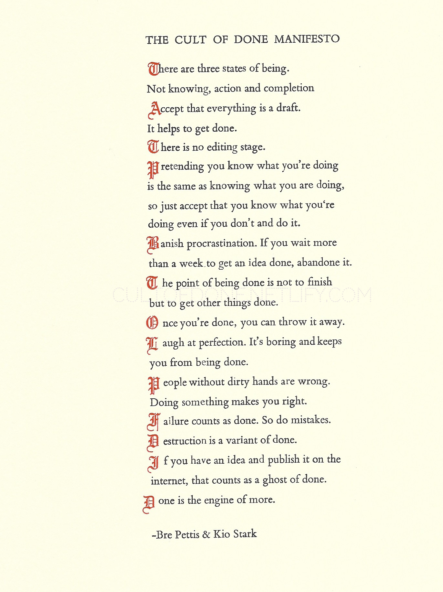

This page tells you what I am up to right now. It’s the brainchild of Derek Sivers. Check out nownownow.com for other inspiring Now pages.

---

<figure class="float-left" style="width: 240px">
    	
    <figcaption>I typeset and print each poster by hand.</figcaption>
</figure>
I've created a limited edition letterpress print of the cult of done manifesto to help inspire people like you. Printed on thick card stock, it can be framed and displayed on your desk or the office wall.

<figure class="float-right" style="width: 240px">
	
	<figcaption>Johannes Gutenberg</figcaption>
</figure>
With his invention of the printing press, Gutenberg was the first European to use movable type printing, in around 1439. Among his many contributions to printing are: the invention of a process for mass-producing movable type; the use of oil-based ink; and the use of a wooden printing press similar to the agricultural screw presses of the period. His truly epochal invention was the combination of these elements into a practical system that allowed the mass production of printed books and was economically viable for printers and readers alike. Gutenberg's method for making type is traditionally considered to have included a type metal alloy and a hand mould for casting type. The alloy was a mixture of lead, tin, and antimony that melted at a relatively low temperature for faster and more economical casting, cast well, and created a durable type.