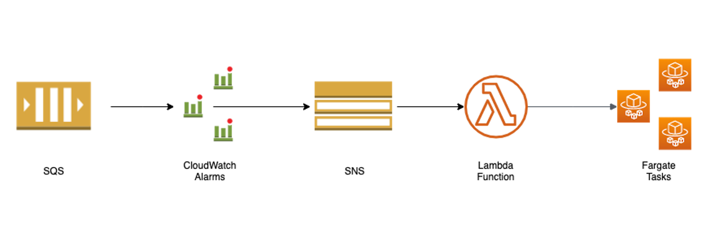

AWS Lambda's 15 minute timeout and [~~512 MB disk space~~](https://aws.amazon.com/blogs/aws/new-a-shared-file-system-for-your-lambda-functions/) limits it's use to short running tasks which don't require a lot of local storage for data processing.

AWS Fargate is perfect alternative in such cases.

Fargate provides us all the mechanics to scale containers based on metrics such as CPU, memory usage, etc, but what if we want to scale Fargate based on a SQS queue depth. Basically, we want to run more tasks, to process more SQS messages at once.

We can use Fargate's [RunTask API](https://docs.aws.amazon.com/AmazonECS/latest/APIReference/API_RunTask.html) to run new tasks based on the queue depth.

#### What you need
- CloudWatch Alarms for different queue depths.
- SNS topic for the alarm to write to.
- A Lambda function to handle the SNS message, look at the alarm details and spin up new Fargate tasks.
- A Fargate cluster and service definition.
- A Docker container which run your task.

#### How does it work?

- Create CloudWatch alarms based on the queue depth at which you'd like to scale Fargate tasks. For example: 
    - Alarm1 at depth > 0; Alarm2 at depth > 100
- Each alarm writes to the SNS topic.
- SNS messages trigger a lambda, which checks the name of the alarm and calls the Fargate RunTask API to start an appropriate number of tasks to handle the incoming SQS messages. For example:
    - Alarm1: Start 1 task; Alarm2: Start 2 more tasks
- Fargate starts your container, which poll's the SQS queue, processes the messages and shuts down when the queue is empty.

For a working example see: [https://github.com/murali44/fargate-scaling](https://github.com/murali44/fargate-scaling)