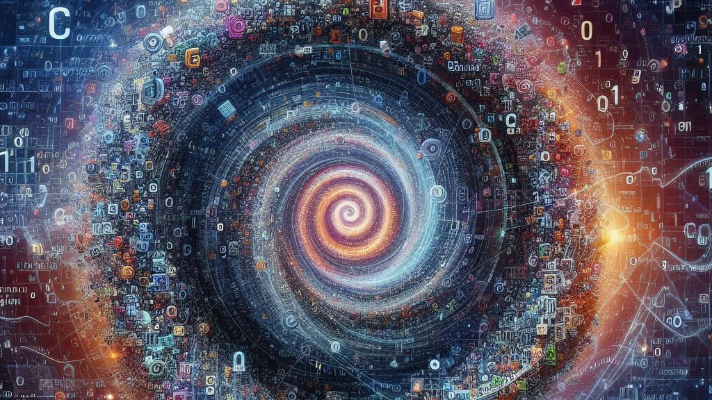

  
Here’s an especially versatile frame of thinking that I like. It’s one of those things that’s blaringly obvious to some people and incredibly profound and useful to others, so hopefully here’s your chance if you haven’t collected this frame yet.  
I like to look at it this way. On the base level of evolution, we have emergent biological complexity. In the steaming primordial swamps of pre-biotic earth, amino acids jumble together and lock into a vast array of proteins. Interestingly though, with time the mixture becomes less homogenous. A few proteins become conspicuously more abundant. What’s the deal? The first of earth’s storied line of replicators has arrived. By some statistical accident, earth has cooked up a greedy protein. Maybe it creates and splits off mirror images of itself like DNA. Perhaps it cannibalizes other proteins, freeing molecules specifically useful for forming more of itself and increasing its likelihood of spontaneously forming. Perhaps it replicates by some other fanciful pathway. But replicate it does, and with no sign of stopping (literally, it’s still going today)! Oh, sure, it’s changed its face a bit. Sometimes a chemical accident would swap out one base for another. Sometimes that was good, sometimes it was bad. The bad cases never made much of a fuss, just sort of disappeared as they became less efficient at replicating. But boy were the good mistakes important. Soon particles start to team up, assembling a complex machine of chemical cogs and levers, replicating ever-faster. This clever abstraction lets selection happen on two layers - that of the chemicals, and that of their child, the “organism”. Now the chain’s chemical -> organelle -> organism. Now it’s chemical -> organelle -> cell -> local colony. Now they’re inventing complex, multi-role colonies that look a lot like animals. And those animals are being selected. Oh, surprise surprise! Looks like the animals are teaming together and the populations are being selected. And now they’re making ideas and art and literature and technology! And that’s being selected too! How in the name of Jibbers Crabst did they pull that off? Selection is happening simultaneously on a dozen levels, so that each system’s abundance is a product of every one of its hierarchical components working together.  
But the point is, selection’s still happening. No matter how abstract you get, information - be it chemical structure, body shape, or poem - proliferates and mutates to find an environmental optimum. A cloud of selection hangs heavy around every complex informational system, embedded through several levels of hierarchy. The world runs on memetics. People are usually most comfortable with the idea of darwinian evolution. But that’s just one rung of the huge hierarchy. Learning and neural pruning? Yeah, basically memetics. Religion? About the biggest memetic sink in existence! News, stories, urban legends, advice, cultural trends? Yep, selection strikes again!  
Consider religion. Do you think we should expect popular religions to be philosophically unsatisfying, morally unappealing, or bad at replicating? Obviously not, because how on earth would they become popular if they were? No, religion is just like those molecules we described before. Emerging from a primitive stew of hunter-gatherer words and ideas, it recombined and evolved. Crude appeasing-the-guy-who-strikes-people-with-lightning evolves into much more complex systems of rituals, morals, signaling traits, and mythologies (remember that molecules can team up?) Of course most religions have fairly good[^1] moral codes! If they didn’t, their carriers would have died or not been converted in the first place, and they wouldn’t have spread! Ditto with news stories. The ones you see are going to be the ones that are best at spreading *because* they had to be spread to reach you.  
So, everything’s memes. Where does this leave us? Well, it’s certainly not a bad thing. In many cases it's just the opposite. For example, the idea that you shouldn’t stick a fork in an outlet is certainly a useful meme. Like a helpful gene the idea promotes its carriers' survival. You should carry this meme. Ideas, however, also have an ability that genes don’t. Being on a higher rung than humans, they can parasitically manipulate. Look at religion again (I really like picking on it, don’t I?) Perhaps it gave people some slight adaptive advantage in the past (like binding groups together or something). But I suspect that most of the reproduction was happening in the idea, not the carrier. That’s to say, I doubt the carrier advantage was very big. More likely, the virulent behaviors of “spreading the good news” made it pass horizontally like a virus (instead of vertically like a gene). That doesn’t necessarily mean it increased carrier fitness, just that it was good at reproducing *itself*. The same applies for most other high-level memes. A meme higher on the hierarchy can *either* help increase the fitness of one of its lower-level carriers or parasitically exploit them. So, by all means, have your culture and ideas. That’s great, and most of them are helpful. But in the interest of truth and wellbeing, think very hard about whether those ideas are as helpful today as they were in their “ancestral” environment, and whether they might just be parasites who’re only in this relationship to exploit you.  

[^1]: At not getting your people killed and helping you collaborate. Since other areas of evolution also favored these values they'll feel "right" or "good".
