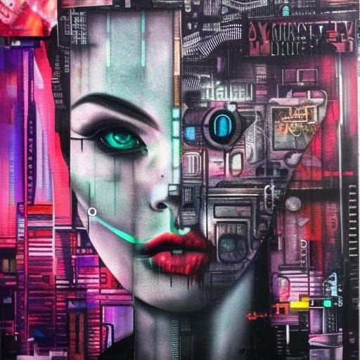

  

*Ooh, lucky you! Two posts in one day! Enjoy this steaming pile of unedited dogshit ranting I wrote at 3 am the other day. I wasn't planning on posting it but what the hell, I'm trying to get over my perfectionism so why not.*  
The sense of unease only comes when I have my computer. A feeling of informational feast, indulging the primitive parts of my brain with a dance of tasty gossip, spicy colors, and the lovely caress of the global superbeing. An analogy to the lotus-eaters feels right, except that the fruits are poisoned.  
The universal brain is my mother. I was raised bathed in the datastream. My brain knows surprisingly well how to handle itself without it, but from inside the system I’d never know. Once I get a single fragrant drop of the internet-nectar, I’m gone. Gone for hours drowned in a mind-numbing symbiosis. I surrender my agency and it pours slavery-chemicals on it. It doesn’t feel good - it feels like grains of sand stuck between the folds of my brain, corrosive acid injected through millions of hair-thin needles into my cortex. And yet I can’t escape.  
The internet is no-self. Your hands and eyes merge with the device, and, in turn, the infinite sugar sea beyond. Time loses meaning, constantly trapped in the present moment but never aware of it. You flip from feed to feed, gorging your brain on novelty. Each new fruit is the one that’ll save your tribe from starvation. Move faster, scan wider, take in the whole landscape. Silly little brain, doesn’t it know that’s impossible? The internet is eternal and infinite - didn’t that old chap get the message?  
“Hey, you can, like, stop. Like, you aren’t really getting much out of this infinite scrolling. You flit from idea to idea - you don’t linger, that’s your problem. You always think the world-saving insight is right around the next corner. Only each time you turn a corner, you run smack into another one.”  
Oh shit, what good advice. I never thought about that one before. Welp, I’ve gotta run. Twelve more youtube tabs in this window *(and this video essay’s editing sucks)* but I’ll definitely remember that. Hmm, what’s up next on the menu? Ooooh, *skibidi toilet offensive memes compilation 2023 ylyl #84 (not for snowflakes)* - yummy!  
  
Why do I feel so…normal, so…clean when I’m not using the computer? This corrupt symbiosis physically changes the way I think. Less contemplative, more sensational. Less depth, more breadth. Less committing, more “what if I could make bacteria synthesize cellulose (startup idea ???)” hastily tapped out and hastilier forgotten in browser hell. I don’t know what opium feels like, but I’d guess the internet’s a good approximation. How the fuck is this shit legal? And how is it so good? Was I messed up early on? Was I groomed by the platform to be a hopeless addict? Can I ever break away? Will I always be the overconfident alcoholic, a month sober, who goes on a 2-week 200-dollar bender the second he sees a busch commercial? Did those fuckers break me, trap me in a purgatorial cycle that I can never escape?  
I hate the web. I hate the people, the colors, the sights and sounds. I hate the soma and the synthetic music and the sex-horomone chewing gum. I hate that it has both everything that I love and everything I lust for. But I love the utility, the everflowing streams of data and the accelerated progress. I hate that you can’t have one without the other - *they* won’t give you one without the other. My brain feels poisoned and effeminate, atrophied and rotted by the malignant scum of technocapitalism and the digital dream of never having to feel again. I love science, but man has it birthed one bloody bastard of a child. Well, guess I’m done with the essay, might as well go and satiate myself with two hours of youtube drivel and shit music (*I feel the itch like an addict*).  
