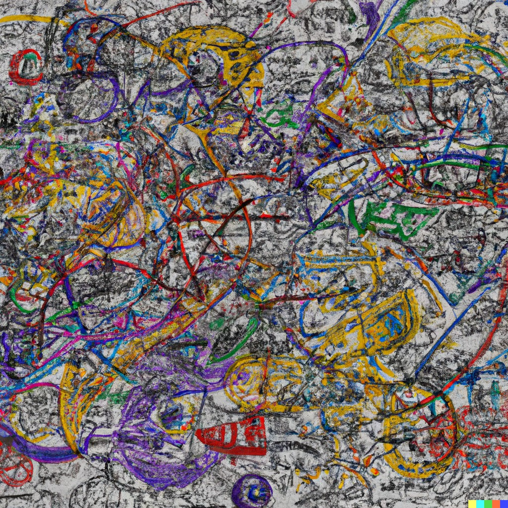

  
*Note: this essay is longer than it needs to be because I tried to be fairly explicit. For something shorter and funner with the same vibes, check out this [incredibly unhinged rant I wrote at 3 am the other day](https://unaligned.world/p/morphine-in-my-mesolimbic).*  
Everyone loves to hate consumer technology in general and social media in particular. *It sets unreasonable beauty and life standards*, *it’s addictive and easy to waste time on*, *it morally corrupts our children*. There are a lot of (usually valid) arguments against them. However, there’s a much darker, more destructive mass lurking below the surface. Especially scary is how seldom it’s acknowledged online, but I suspect other people see it too. The brain wasn't built for the riotous flux of information you get blasted every time you open a web browser. Personal devices are terminals into a violent datastream, forcing huge amounts of disorganized information down your throat and flaying your mind.  
Technology makes it trivial to parallelize your brain. Why use the measly 2 or 3 active-awareness slots in your brain when you can easily spam open two dozen youtube tabs with the flick of a finger? Why drill in on one idea and learn it deeply when you can tap into an infinite stream of sweet, sweet novelty and never be bored again? The information-dense, parallel design of web browsers, data-dumping social media, and even notepad applications makes it way too easy to overload your brain’s multiprocessing abilities. Of course this issue has existed since the advent of writing. Of course it’s always been possible to make notes and store ideas externally to your brain and drown yourself in a sea of 30 different thoughts and ideas when your brain can only hold a few natively. But browsers make it too easy. Right now, I’ve easily got 50 tabs open across several browser windows. At times, it’s been upwards of 200. Most of them, I only look at again in order to close. But at the time, each of them feels like a precious gem in the rough. Like the thing I *needed*. Like a brilliant idea that I should act on immediately (as soon as I read these other 5 articles and spawn in one hell of a parallelized rabbithole). Maybe others don’t have this problem as much as me (anecdotally, probably 70% of people I talk to say that they *definitely* don’t use technology that way). But at least for some percentage of people do.  
The promise of the internet was infinite seas of data and learning and enlightenment. What they didn’t tell you was that it’s *really* easy to drown in those seas. It’s far too easy to, the moment you get bored, hop-skip-jump your way over to another page and shove more novelty down your gullet. The irony of the internet is that the abundance of information makes it *harder* to get good at any one thing in particular. Because the temptation of the great Something Better lurks right around the corner. Evolution did us a dirty one, giving us curious, novelty-seeking minds. Every new bit of information hits the brain like heroin straight to the vein. The internet’s a data slot machine, but you can never run out of money to play with, and you can *never* truly win. I might get a dozen interesting ideas for projects in a day, neatly packaging each up in a chrome tab, foolishly expecting to get back to it some time in the next 50 years. Wrong! There’s so much tasty data out there! So many better ideas! The great Better’s out there. I never want to miss out, to tear my eyes from the screen and miss the *really* good stuff! While you’re in this cycle, you’ll never do anything worthwhile. Because like a coked-up adhd honey bee in a skittles factory, you can’t stop buzzing around. You can’t settle on anything, can’t actually think.  
Oh, and there’s the noise, too. The noise that never stops. It roars in your ears, both literally and metaphorically. The background music and podcasts and funny videos you’d die without. Die because you were left alone with your own thoughts, no voices to fill the void inside your head. Or the articles, the blog posts, ripe berries hanging fresh on a bush. Your curious hunter-gatherer brain would starve if you kept it away from these. You can feel the drop of chemical pleasure soak your brain’s surface each time you read an interesting title. An ever-present reminder that you can never escape your ancestral upbringing. That you’ll always be your animal brain’s bitch. No thoughts going on today. Nope, maybe tomorrow! Today is a blended-up slurry of a dozen other people’s thoughts and voices and dreams!  
And who could forget the numbness? That’s right, all that data can kill your emotions. Guess that heroin analogy goes deeper than I thought. When you’re tapped into the datastream, you lose yourself. You merge with the screen and indulgent pleasure envelops you. You don’t need to worry about the emotional pains of real life for now. Hell, you don’t need to worry about *any* emotions. It’s called alexithymia, characterized by an inability to differentiate emotions, a feeling of (pained) sterile numbness, and a general lack of motivation. I *definitely* had this for a while, and it sucks. People talk about how instagram fucks with your body-image and makes you depressed. That’s probably true, but just getting rid of the fakeness won’t fix it. The internet itself, with its pretty colors, feel-good music, and unreal invincibility, will make you depressed. If you let yourself, if you soak in it too long, it’ll destroy your brain. It saps the pleasure out of the everyday stuff. It makes you feel less human, more robot. More braindead consumer. More chemical-soaked, impotent dishbrain.  
  
## Come back to the real world  
So, you want to come back to the real world. To stop compulsively hooking into the datastream. Are you sure? Like realllllly suuuuureeeee??? Nah, just kidding, though some part of your brain really isn’t. It insists that the internet does a lot of good and that you can’t learn well without it and that it’d be hard to quit and it’d mess up your whole schedule and that - . I call bullshit. From inside, it feels like you’ll miss a lot and it’ll turn your whole world on its head, but it won’t. What it will do is give you a lot more time and motivation, intensify your emotions and make you feel more human, ~~and give you a smug sense of superiority over those screen-addicted corporate slaves.~~  
In the real world, it’s laborious to switch between tasks. It’s easier to drill down into what you want to do and do it. You don’t get a massive dopaminergic reward for simply flicking your finger the right way a few times. Reward scales (thank you evolution!) pretty linearly with effort. Of course you’ll still need the internet for some things - work, writing, contacting friends - but the majority of the time you definitely don’t need it. If you can, try to totally cut yourself off for a few days. That’s long enough to ~~be converted~~ see the difference. Books are *far* more satisfying than videos, and they won’t leave that hungry, irritated aftertaste in your brain. Working without music is much more focused and *fun*. It feels really nice to not be a slave to technology, and I think losing a small amount of entertainment is a fair price to pay. Your mind will be locked onto a few main tracks, and it’ll be hard to work yourself into that frazzled, distracted state of clothespins pulling on your brain from a dozen directions that scrolling your 75 open tabs is prone to do. Tab limiters are good if that’s your problem. I think you’ll find that most of your open ones aren’t nearly as important as they feel. If your problem is the data-hoses of instagram, reddit, or [youtube](https://unhook.app/), there are extensions to kill the novelty. Uninstall them from your phone entirely to make accessing them that much more annoying. If you’re feeling super hardcore, go full grayscale on your devices. Turns out that a lot of that “joy” is actually just a buzz of pretty, distracting colors. I didn’t start out trying to make a guide for freeing yourself, but these things are all pretty useful hacks. I think, though, that the only way to truly get out of the loop is to cut yourself free. Leave the internet for a few days. That’s enough to realize how poisonous it really is, and I think that once you grok that, the rest of the process of un-distraction is pretty easy.  
