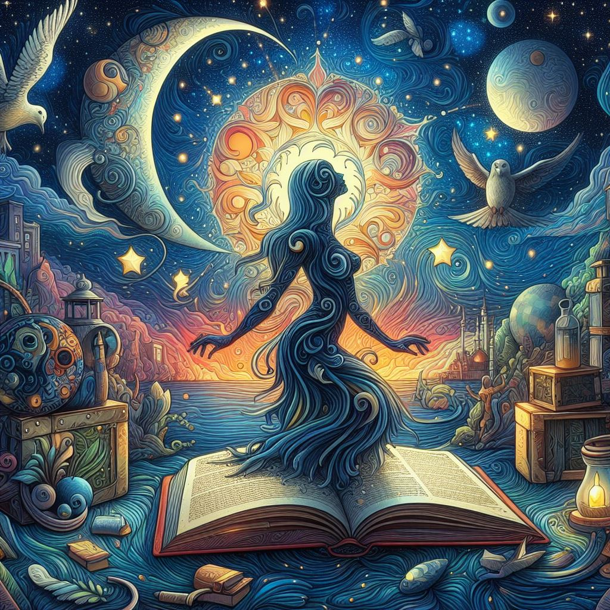

  
Just a short note for today since I don’t have much time.  
I’ve noticed a common trend in almost all of the interests I’ve developed these past few years: *my parents would be pissed if they knew about them*. Some quick context. I was raised in a book-loving but fundamentalist christian household. How the hell did that tension work out? Just about how you’d expect. Folks held a lot of contradictory opinions, simultaneously spouting the virtues of knowledge and thought and suppressing the most basic facts when they happened to contradict the Unfailing Word of Republican Jesus. I guess I have a pretty interesting perspective on this contradictory self-deception, coming from a household where it ran rampant, but that’s a different blog post for a different time. The point is, true knowledge was shunned. I was encouraged to read but forbidden to consider many things. The idea of evolution was ridiculed and anything but the most elementary, stamp-collecting-level biology textbooks were taken away from me. The big bang was stupid (what kind of idiot believes that something could come from nothing?!?) And the prevailing atmosphere was anti-philosophical. It extended beyond the household into the carefully-selected religious communities, where blind ignorance was worshiped and no one would ever consider interesting questions like our place in the universe or the moral implications of death. I felt utterly isolated, though I guess I didn’t even fully comprehend how much I was missing at the time.  
Fast forward to the present, and it’s obvious that this idea-suppression has fundamentally impacted me. Though not as you might think. No, in fact, every single private passion I’ve developed in the past few years - cosmology, longevity technology, alignment, genetics - deeply conflicts with my parent’s philosophies at countless points. Obviously they’ve eased up on the gestapo antics as I got older, but the fact is that all the things I love are fundamentally things that I was forbidden to learn about as a kid. I don’t think that’s a mistake. I think that the fact that I never got close to exploring them as a kid made them *that much more novel* to me now. I don’t think it’s rebelliousness or revenge or anything like that. No, I definitely love my parents, however much I hate the viral mind-worm they, like too many others, are strangled by. Instead, I think that as you grow up, your initial set of interests often grows stale. They feel ordinary, uninteresting. I think that if I’d been taught about evolution from the time I was a kid, I wouldn’t have been nearly as interested in genetics now. Churches have this idea of a “convert’s fervor”. Basically, the church grows stale to people raised in it from the time they were kids. It’s ordinary, boring. But for the converts, the story goes, the crushing weight of forgiveness overwhelms them. They become some of the strongest and most ~~virulent~~ zealous christians. I think something similar happened to me, only in the opposite direction. I love all of these beautiful, deep, satisfying sciences *because* they were hidden from me up to a few years ago. I think that in general you can expect things you haven’t explored and grown stale to to hold an extra amount of novelty and joy for you. And while I *certainly* don’t condone withholding knowledge so beautiful and fundamental as the way the universe works from kids, I do think it might create very strong (if bitter) passion. Humans tend to delight in the hidden. Perhaps it’s a good idea to look at what intellectual areas you haven’t explored much. To see what stones are still fresh to turn over. Because you might be surprised just how lovely the hidden worlds you find are.  
