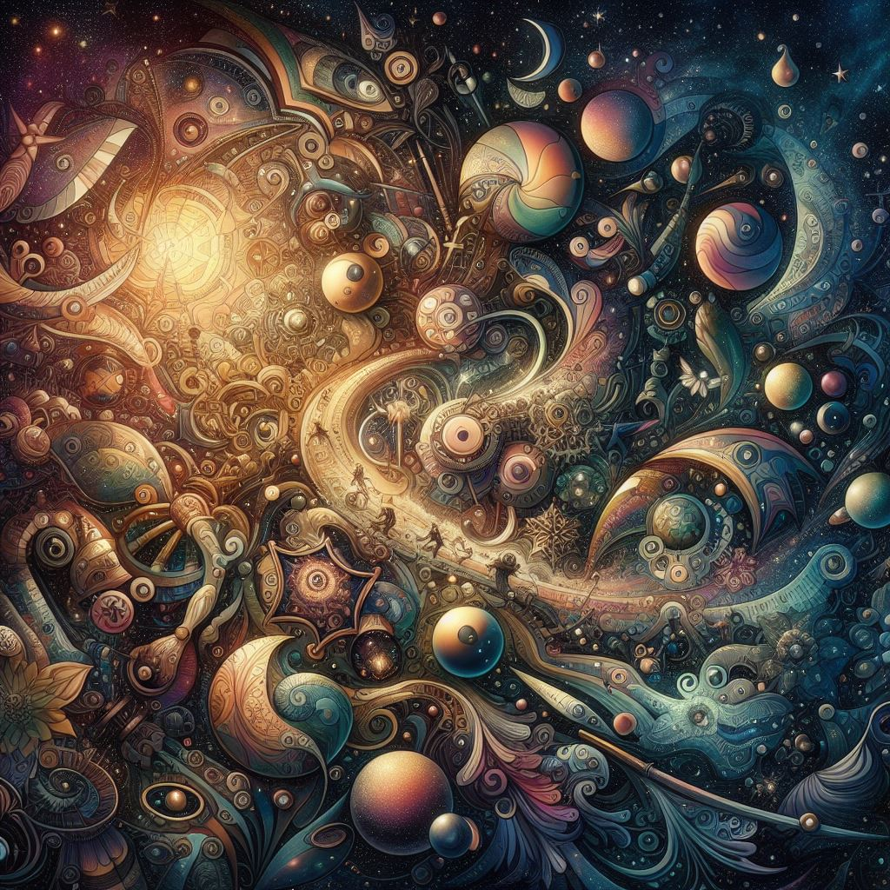

  
Over the past few months, a single quote has rocked my entire worldview, shattering a corrupted edifice of wannabe objectivism and machine-like utilitarianism. It left behind a much more accepting, much more human, much happier view of the world. I suspect that in some people it’d do just the opposite - making them more empirical and less intuitive. It’s great at normalizing extreme worldviews. It’s incredibly powerful. And if your worldview doesn’t accommodate it, it’s probably fucked. Now just *who* dropped this absolute thermobaric bomb on my philosophy? [~~Our omnibenevolent, superintelligent lord and savior~~](https://www.lesswrong.com/posts/Ndtb22KYBxpBsagpj/eliezer-yudkowsky-facts) Eliezer Yudkowsky, that’s who! I know it’s cliche to say that HPMOR changed my life, but I think that it’s totally justified here. The quote? “What people really believe doesn’t feel like a BELIEF, it feels like the way the world IS.”  
I like this quote because it rings so *true* in my own life. At the age of 5, I’d have answered that Jesus was unquestionably, definitely, and obviously the Savior and that if I stopped believing I’d burn in hell. During my 7th grade edgelord phase I’d be caught saying that “Donald Trump is the best thing to happen to our country this decade” (🤮). And just last year I’d have rolled my eyes if you said that saving the world isn’t a moral obligation.  
You can see it in others too. The devout Christian certain that they saw a daemon while playing the ouija and that prayers will cure their mom’s cancer. The middle-aged dude who swears the election was rigged and that big pharma’s trying to microchip him. The average person certain beyond a doubt that they’re not a Boltzmann brain. Obviously these are very different effects on very different scales, but the point’s the same - we treat so many things we can’t be certain of as tacit facts. Such simplifications are necessary. It’d be impossible to live life on the highest resolution - always explicitly assigning probabilities and recognizing that there *are no facts*. But as a meta belief, it’s a miracle. It makes you less myopic. More empathetic. Less self-assured and more willing to change your mind. Because it’s hard to change your mind about facts per se, but things that feel like beliefs are much easier to part with. They feel disposable, abstract, unimportant. When you get used to looking at the system from the outside instead of from within, you become more flexible.  
It’s hard to be arrogant when you understand that you could be wrong and not know it. You want to hear others’ opinions more when you realize that they feel the same way to them as truth feels to you. Considering the beliefs-masquerading-as-facts in my own life changed me from a tacit life-value-utilitarian to a moral anti-realist. From a 100% certain militant atheist to an epistemic agnostic. My values became more cosmopolitan, more pliant, and probably more correct. I think that tacking on an implicit “but I totally could be wrong, even if it doesn’t feel like it” to your beliefs is the right way to go. And realizing that most of your beliefs are *just* beliefs forces that.  
I think the best way to grok this is to see *big* examples firsthand. Preferably from the driver’s seat. When your religious, philosophical, or political views change, take a second to think. Remember how *certain* you felt that you were right and everyone else was wrong. Well you *are* that someone else! Still feel that way? No way, Jose! Now you realize that *that* you was stupid. So what are the odds that you’re right now? Not incredible - you’ve been wrong before. So I think it’s very fruitful to reflect on all the people in your life (yourself included) who have different “truths”. It’s pretty fascinating and humbling. And I think that one of the best things you can do to make good epistemics intuitive is to understand this deeply.  
