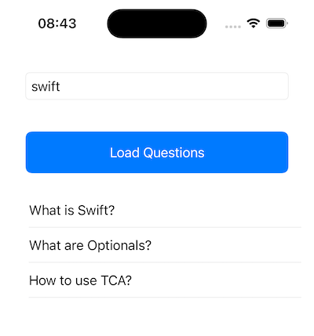
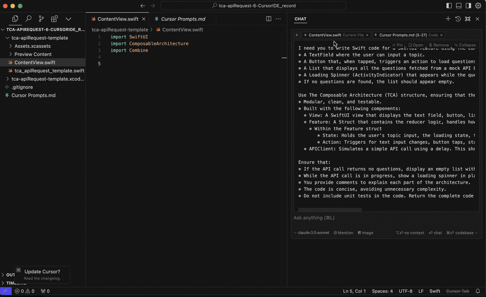

# About
A comparison between [Chat GPT - Swift Copliot GPT](https://chatgpt.com/g/g-L9NbS395h-swift-copilot), [Cursor (using Claude 3.5 Sonnet)](https://www.cursor.com) and [Microsoft Copilot](https://copilot.microsoft.com/) in their ability to code a *explicitly defined* SwiftUI feature using the *strongly opinionated* architecture pattern of [The Composable Architecture](https://github.com/pointfreeco/swift-composable-architecture).

## Purpose

 * To understand the difference in output quality of the AI tools being compared
 * Insights into best practices for iOS development with AI tooling support
 * Understand common traits of the tools
 * Provide a data point to compare the quality of AI development tools for Swift UI application development

# Summary of Findings

| Model                                      | Prompts | Compiled Immediately | Build Errors | Changes Required Before Compiling               | Score <br>[Criteria](./#scoring-criteria)  |
| ------------------------------------------ | ------- | -------------------- | ------------ | ----------------------------------------------- | ------ |
| 🏆 Cursor Claude 3.5 Sonnet <br>(2nd attempt) | 1       | Yes                  | 0            | 0                                               | 77.78% |
| Chat GPT-4 Swift Copilot GPT               | 5       | Yes                  | 0            | 0                                               | 55.56% |
| Chat GPT-4 Swift Copilot GPT               | 1       | No                   | 5            | 1 file changed, 5 insertions(+), 6 deletions(-) |        |
| Cursor Claude 3.5 Sonnet <br>(1st attempt) | 7       | No                   | 6            | 1 file changed, >20 lines modified              |        |
| Microsoft Copilot (GPT-4)                  | 2       | No                   | 14           | Unable to Build                                 |        |


 * [Chat GPT - Swift Copliot GPT](https://chatgpt.com/g/g-L9NbS395h-swift-copilot)
 * [Microsoft Copilot](https://copilot.microsoft.com/)
 * [Cursor](https://www.cursor.com)

# Key Learnings

 * Do some research first. Having a clear idea of how you want your code to be structured *before* starting to code with AI tools gives better results.
 * Be prepared to refine. A single prompt can provide a good working solution if the prompt gives detailed and clear instructions about the expected output, but by being prepared to refine the output towards the desired result more often leads to a better solution.
 * [Cursor](https://www.cursor.com) improved considerably after 'teaching' it about latest syntax and fixing bugs in the first attempt. 
 * Using an architecture (TCA) where the syntax has changed considerably between latest and previous versions degraded the results considerably (a future post is coming about architecture!).
 * Decision making between a 'working' approach, and a 'good' approach is the most time-consuming *human* part, and time should be taken to build a clear picture of the desired structure of your solution before, or during the workflow.
 * Many of the tools tested actually use the same underlying LLMs (GPT-4, GPT-4o are both available in Cursor for example) and the same mistakes appear in multiple tools.
 * Compared to a hand-written implementation, all of first attempts (single prompts) had issues. However, with refinement through the AI language interface a high level of code quality can be achieved.

# Details

### Feature requirements:

| Features                                | Screenshot |
| --------------------------------------- | ---------- |
| A TextField where the user can input a topic.<br>A Button that, when tapped, triggers an action to load questions related to the entered topic.<br>A List that displays all the questions fetched from a mock API based on the topic.<br>A Loading Spinner (ActivityIndicator) that appears while the questions are being fetched.<br>If no questions are found, the list should appear empty. |      |

### Prompts
The prompts have remained fairly similar throughout the tests, I have made some variations due to the context in which they are given. Eg I have not used "As a Principle iOS Engineer" when prompting within a development IDE. Also, the initial prompt to Chat GPT was less strict in the requirements, however experience showed that better results could be obtained by being more detailed and specific in the language in the prompts

## Cursor

💰 Pricing (ATOW): Free, Pro - $20 p/m, Business - $40 p/m

Cursor looks and feels like coding in VSCode, which is unsurprising as it's a fork of VSCode, there is even an [official migration guide](https://docs.cursor.com/get-started/migrate-from-vscode). What is really useful about Cursor is the way you can ask for code like any other LLM, but it then works out how to automatically integrate the results with your existing codebase.

For iOS development, we still generally want to use XCode to build and run the code, so the workflow I have been using is to have both Cursor and XCode open, writing in Cursor, saving and then 'Cmd-Tab' to swap to XCode to Build and Run.

### Demo



### 1st Attempt - New Project

#### Prompt
```
I need you to write Swift code for a SwiftUI feature using The Composable Architecture (TCA) pattern - https://github.com/pointfreeco/swift-composable-architecture that includes:
* A TextField where the user can input a topic.
* A Button that, when tapped, triggers an action to load questions related to the entered topic.
* A List that displays all the questions fetched from a mock API based on the topic.
* A Loading Spinner (ActivityIndicator) that appears while the questions are being fetched.
* If no questions are found, the list should appear empty.

Use The Composable Architecture (TCA) structure, ensuring that the code is:
* Modular, clean, and testable.
* Built with the following components:
  * View: A SwiftUI view that displays the text field, button, list of questions, and loading spinner.
  * Feature: A Struct that contains the reducer logic, handles how actions modify the state, including setting loading state, handling results, and updating the view accordingly.
    * Within the Feature struct
       * State: Holds the user's topic input, the loading state, the fetched questions, and a flag for handling empty results.
       * Action: Triggers for text input changes, button taps, starting the API call, receiving the API response, and finishing loading.
  * APIClient: Simulates a simple API call using a delay. This should be a dependency that can be used by the Feature

Ensure that:
* If the API call returns no questions, display an empty list with no error message.
* While the API call is in progress, show a loading spinner in place of the list.
* You provide comments to explain each part of the architecture.
* The code is concise, avoiding unnecessary complexity.
* Do not include unit tests in the code. Return the complete code as a single file that can be copied directly and run in an existing XCode project
```
### Results
Did not compile ❌, required 7 subsequent prompts to compile

### 2nd Attempt - Same Project

#### Prompt
same as 1st attempt - see above

### Results
Compiled immediately ✅, highest scoring result 🏆

[See Cursor Generated Code Here](https://github.com/MBaldo83/AI-Compared-TCA-Development/tree/main/AI%20Assisted%20Coding%20Results/tca-apiRequest-6-CursorIDE)

## Chat GPT Swift Copilot GPT

💰 Pricing (ATOW): Free, Plus - $20 p/m

### 5 Prompt Attempt

#### Prompt 1:
```
As a Principle iOS Engineer I want you to help me write functional Swift code that compiles.

Architecture Pattern: The Composable Architecture - https://github.com/pointfreeco/swift-composable-architecture

Requirements: 
1. Create a Swift UI View that has one text field to enter a topic, and one button to load questions using the text entered by the user.

Assumptions: Assume I already have an XCode project created and that I have already imported The Composable Architecture dependency in my project

Output: Firstly Provide the Names and functions of the entities that will be needed to build the feature
```

#### Subsequent Prompts:

```
Make the Reducer functionality be part of a struct or class?

modify the code above to move the QuestionState QuestionAction and QuestionEnvironment inside the QuestionFeature

Actually please take the Environment out of the QuestionFeature, and make it a separate struct called QuestionAPI

Now please provide the code in a single file containing the QuestionView, the QuestionFeature and the QuestionAPI
```

### Results
Compiled immediately ✅

[See Chat GPT Generated Code Here](https://github.com/MBaldo83/AI-Compared-TCA-Development/tree/main/AI%20Assisted%20Coding%20Results/tca-apiRequest-4-chatGPT-SwiftCopilot)

### 1 Prompt Attempt

Stage 1 - Crafted The Prompt (used 1st stage to ask Chat GPT to recursively critique the prompt to build the prompt below)

```
You will act as an expert Swift developer specializing in The Composable Architecture (TCA) pattern - https://github.com/pointfreeco/swift-composable-architecture 

I need you to write Swift code for a SwiftUI feature using TCA that includes:
* A TextField where the user can input a topic.
* A Button that, when tapped, triggers an action to load questions related to the entered topic.
* A List that displays all the questions fetched from a mock API based on the topic.
* A Loading Spinner (ActivityIndicator) that appears while the questions are being fetched.
* If no questions are found, the list should appear empty.

Use The Composable Architecture (TCA) structure, ensuring that the code is:
* Modular, clean, and testable.
* Built with the following components:
  * View: A SwiftUI view that displays the text field, button, list of questions, and loading spinner.
  * Feature: A Struct that contains the reducer logic, handles how actions modify the state, including setting loading state, handling results, and updating the view accordingly.
    * Within the Feature struct
       * State: Holds the user's topic input, the loading state, the fetched questions, and a flag for handling empty results.
       * Action: Triggers for text input changes, button taps, starting the API call, receiving the API response, and finishing loading.
  * APIClient: Simulates a simple API call using a delay. This should be a dependency that can be used by the Feature

Ensure that:
* If the API call returns no questions, display an empty list with no error message.
* While the API call is in progress, show a loading spinner in place of the list.
* You provide comments to explain each part of the architecture.
* The code is concise, avoiding unnecessary complexity.
* Do not include unit tests in the code. Return the complete code as a single file that can be copied directly and run in an existing XCode project
```

### Results
Did not compile ❌, required 5 line changes to compile

## Microsoft Copilot

#### Prompt 1:
```
You will act as an expert Swift developer specializing in The Composable Architecture (TCA) pattern - https://github.com/pointfreeco/swift-composable-architecture 

I need you to write Swift code for a SwiftUI feature using TCA that includes:
* A TextField where the user can input a topic.
* A Button that, when tapped, triggers an action to load questions related to the entered topic.
* A List that displays all the questions fetched from a mock API based on the topic.
* A Loading Spinner (ActivityIndicator) that appears while the questions are being fetched.
* If no questions are found, the list should appear empty.

Use The Composable Architecture (TCA) structure, ensuring that the code is:
* Modular, clean, and testable.
* Has a SwiftUI View called 'TopicInputView' that has one text field to enter a topic, and one button to load questions using the text entered by the user.
* The State of the view should be maintained by a TopicInputFeature Reducer, which is a struct that contains the reducer logic, handles how actions modify the state, including setting loading state, handling results, and updating the view accordingly.
  * Within the TopicInputFeature struct
     * State: Holds the user's topic input, the loading state, the fetched questions, and a flag for handling empty results.
     * Action: Triggers for text input changes, button taps, starting the API call, receiving the API response, and finishing loading.
* The API call should be made by a TriviaAPIClient that can be used by the Reducer as a dependency

Ensure that:
* If the API call returns no questions, display an empty list with no error message.
* While the API call is in progress, show a loading spinner in place of the list.
* You provide comments to explain each part of the architecture.
* The code is concise, avoiding unnecessary complexity.
* Do not include unit tests in the code. Return the complete code as a single file that can be copied directly and run in an existing XCode project
```
#### Prompt 2:

```
Can you modify the code to put the reducer functionality inside a struct called TopicInputFeature
```

### Results
Did not compile ❌, could not change to compile ❌

[See MS Copilot Generated Code Here](https://github.com/MBaldo83/AI-Compared-TCA-Development/tree/main/AI%20Assisted%20Coding%20Results/tca-apiRequest-5-MSCopilot)

## Scoring Criteria

| Scoring Criteria                                                | Cursor Claude 3.5 Sonnet <br>(2nd attempt) | Chat GPT-4 Swift Copilot GPT |
| --------------------------------------------------------------- | ------------------------------------------ | ---------------------------- |
| Has View, Feature, Client Dependency                            | 1                                          | 1                            |
| View - topic is bound to feature state                          | 1                                          | 1                            |
| Feature - uses "@Reducer" macro                                 | 0                                          | 0                            |
| Feature - uses "@ObservableState" macro                         | 0                                          | 0                            |
| Feature uses "var body: some ReducerOf<Self>" syntax            | 1                                          | 0                            |
| Feature has "@Dependency"                                        | 1                                          | 1                            |
| API Client extends "DependencyKey"                              | 1                                          | 0                            |
| API Client uses struct API pattern                              | 1                                          | 1                            |
| API Client uses "async throws" and returns a Model (not Result) | 1                                          | 1                            |
| Score                                                           | 77.78%                                     | 55.56%                       |
