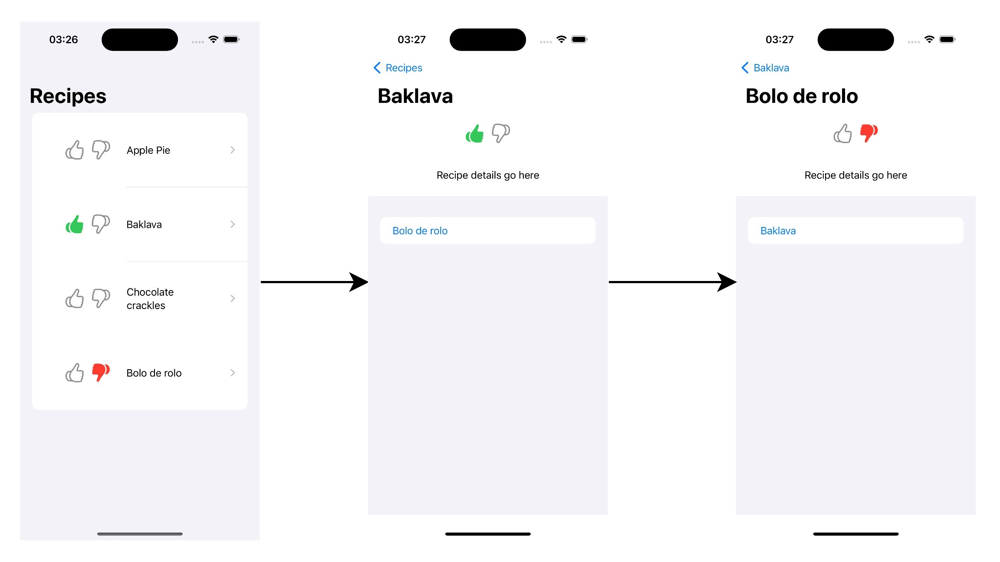
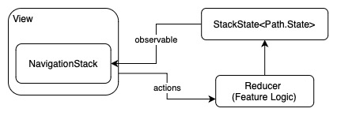
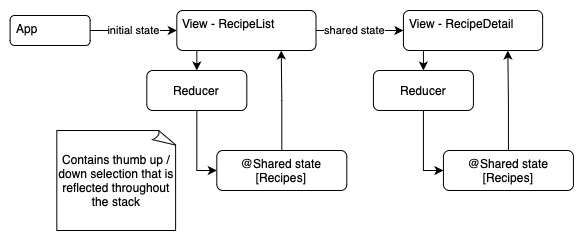
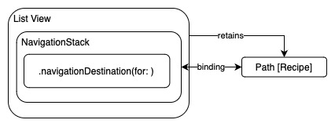
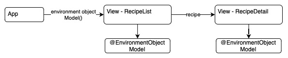
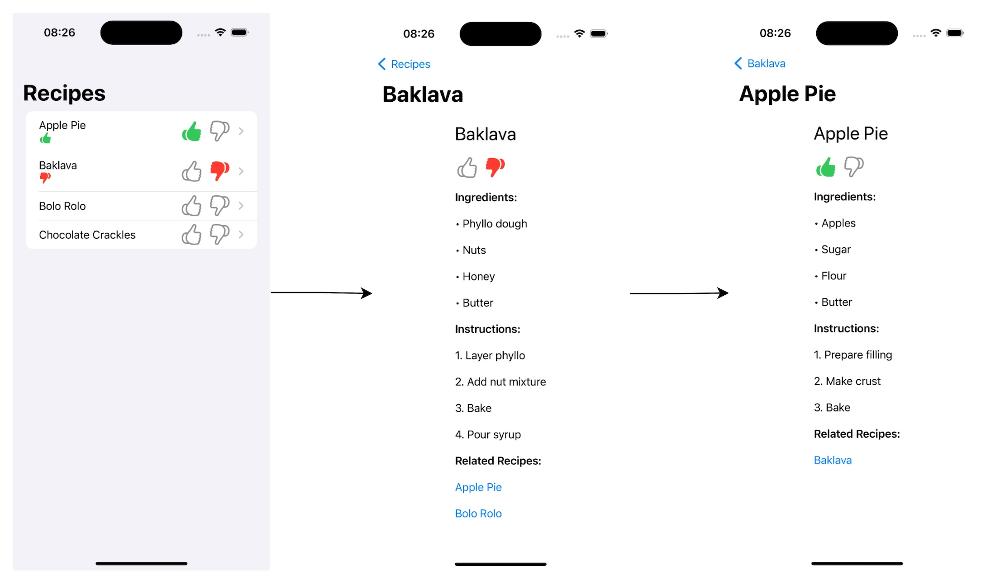

# About

# Summary of Findings

# Example Feature

To compare architecture patterns I have described a simple feature set that can be contained within less than 5 files. I have chosen 2 app features to allow the architecture patterns to expand into their different structures; navigation and shared state.

# Architectures

## The Composable Architecture (TCA)

The Composable Architecture (TCA) is a *strongly opinionated* Swift framework for building modular, testable, and predictable state management in iOS applications using a unidirectional data flow, combining state, actions, and side effects into a single cohesive structure.

TCA single view structure showing Unidirectional Data Flow (UDF)

TCA navigation using NavigationStack (iOS 16+)

TCA Shared State

### For and Against TCA

These are not my opinions from experience, but they do make sense with my current understanding of TCA.

* For
  * Highly opinionated architecture leading to more consistent overall approach to implementations over time
* Against
  * Steep learning curve and on-going complexity
  * Reliance on SPM still has issues when building apps
  * Overhead due to maintenance of a 3rd party library

### References

* [TCA Documentation](https://pointfreeco.github.io/swift-composable-architecture/main/documentation/composablearchitecture)
* [TCA Stack Based Navigation](https://pointfreeco.github.io/swift-composable-architecture/main/documentation/composablearchitecture/stackbasednavigation)
* [TCA Sharing State](https://pointfreeco.github.io/swift-composable-architecture/main/documentation/composablearchitecture/sharingstate)

## Model-View (MV)

Model-View (MV) is a flexible and fairly *un-opinionated* architecture pattern for iOS Swift applications separates the app into two main components: the Model, which handles data and business logic, and the View, which manages the UI.

MV single view structure

MV navigation using NavigationStack (iOS 16+)

MV Shared State

### Building the Features Using MV Architecture

Result:

* Time taken to complete app: ~40 minutes
* Number of build errors during process: 1
  * build errors fixed by AI: 1

See the [generated source code here](https://github.com/MBaldo83/LLM-SwiftUI-Architectures-Compared/tree/main/LLM%20Implementations/Model%20View%20Architecture/MV%20Receipes)

Tools used:
* Cursor AI Version: 0.41.2
  * LLM: claude-3.5-sonnet
* VSCode Version: 1.91.1
* Xcode 15.4
* iOS 17.5

Workflow:
1. Generate key entities (View, Model)
2. Update Model Layer
3. Update View Layer

### MV References
* https://azamsharp.com/2022/10/06/practical-mv-pattern-crud.html
* https://azamsharp.com/2023/02/28/building-large-scale-apps-swiftui.html
* [Apple The SwiftUI cookbook for navigation](https://developer.apple.com/videos/play/wwdc2022/10054/)
