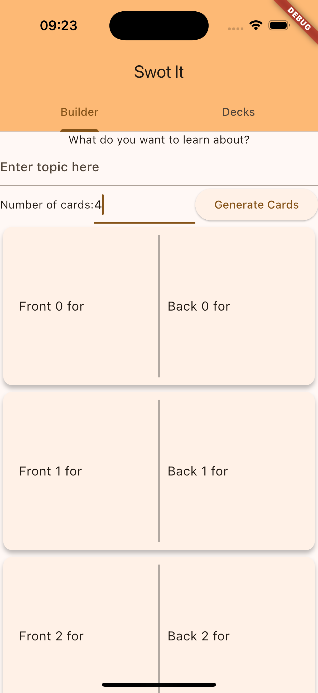

# About

I take a [similar set of prompts](https://github.com/MBaldo83/AI-Coding-Examples-Swot-It/blob/main/swot_it_flutter_prompt_built/README.md) used to build a Swift UI app, and use them to build a [Flutter app](https://docs.flutter.dev).
## Why?
* Firstly: To explore how well the AI tools cope with Flutter
* Secondly: Starting to explore a workflow where development begins by (collaboratively) writing cross platform prompts before 'deploying' these with your expertise to write maintainable code.

# Summary of Findings

| Question                                                                                                  | Result                                 |
| --------------------------------------------------------------------------------------------------------- | -------------------------------------- |
| Can AI Assisted Coding be used for Flutter Apps?                                                          | 👍 Yes! In this example it worked well |
| Can the same prompts be used to build different implementations of the same features eg (Swift & Flutter) | 🗺️ Yes, worth exploring            |

## Key Takeaways

1. I had to change very little to adapt a set of 4 prompts used to build a small Swift UI app into 4 prompts that successfully built a Flutter app. 
2. To use this in production to produce code that can be maintained, tested and fits within production standards requires knowledge and expertise to implement properly. For example the code produced is continuously added to the same file and you need to ask the tool to refactor elements out if you want to re-use them.

# Prompts to Flutter App

[List of prompts documented here](https://github.com/MBaldo83/AI-Coding-Examples-Swot-It/blob/main/swot_it_flutter_prompt_built/README.md)

| Prompt                      | Errors | Result | Demo |
| --------------------------- | ------ | ------ | ---- |
| View Scaffolding            | 0      |     |   |
| Scrolling List of Cards     | 0      | -    | -  |
| Model API to generate cards | 1 Error: Rebuilt CardView with new argument requirements and didn't update call site      | -    |   |
| Integrate Model with View   | 0      |     |   |

## Prompt Reference

View Scaffolding

<pre class="language-text"><code class="language-text">I need you to write Swift code for a SwiftUI feature using The I'd like to build a Flutter View with the following elements (top to bottom):
1. A title label with the text "What do you want to learn about?"
2. A text field (topic) with multiple lines to input with placeholder text "Enter topic here"
  - The value of this text (topic) should be bound to a variable that can be used when performing an action
3. A Horizontal Stack with text: "number of cards", an input box (numberOfCards) that accepts Integers only and a button to generate the cards
- The value of the numberOfCards input box should be bound to an integer variable that can be used when performing an action
4. A scroll view containing the list of cards that are generated

This view should be contained inside a Tab Bar with 2 tabs, "Builder" (this view) and "Decks" (an empty view)
Please ensure: 
1. That the Scrolling List View of cards is performant when rendering any number of cards on the screen
2. The View to represent a Card in the list is refactored so that it can be modified independently of the the containing List view
</code></pre>

Scrolling List of Cards

<pre class="language-text"><code class="language-text">The UI to display a Card in the scrolling list view should be:
Card Dimensions height: 200, width: filling the screen with padding of 10
The card should be divided vertically down the centre with a dotted line 1 point wide
The Card should have 2 not-editable text fields one on the left of the dotted line and the other on the right of the dotted line filling the space with a padding of 10
To render a card you should provide 2 static strings, front (left side of card) and back (right side of card)
The card should have a subtle drop shadow
</code></pre>

Model API To Generate Cards

<pre class="language-text"><code class="language-text">Using the 'Model View' Architecture Pattern Implement a SwotItModel API that the view can call to generate cards
API Definition:
* There should be a method called generate cards.
* This should take 2 arguments from the UI; topic (String) and numberOfCards (Int)
* This method should return asynchronously
* When this method completes, it should update the scrolling list of cards in the UI
* The implementation of this method should return a hard coded list of Card Models tha can be displayed by the View
</code></pre>

Integrate Model with View

<pre class="language-text"><code class="language-text">Update _BuilderViewState to include an array of CardModels 
This should start empty, and should be populated by the async call to generate cards made to the model when the generate cards button is pressed
</code></pre>

# Tools used

* Cursor AI Version: 0.41.3
  * LLM: gpt-4o-mini
* VSCode Version: 1.91.1
* Xcode 16.0
* iOS 18
