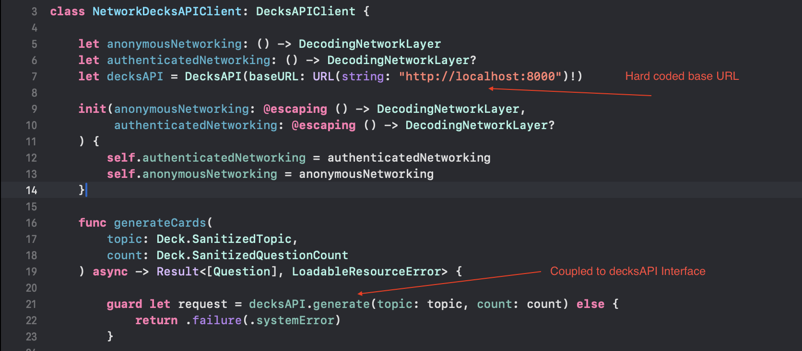
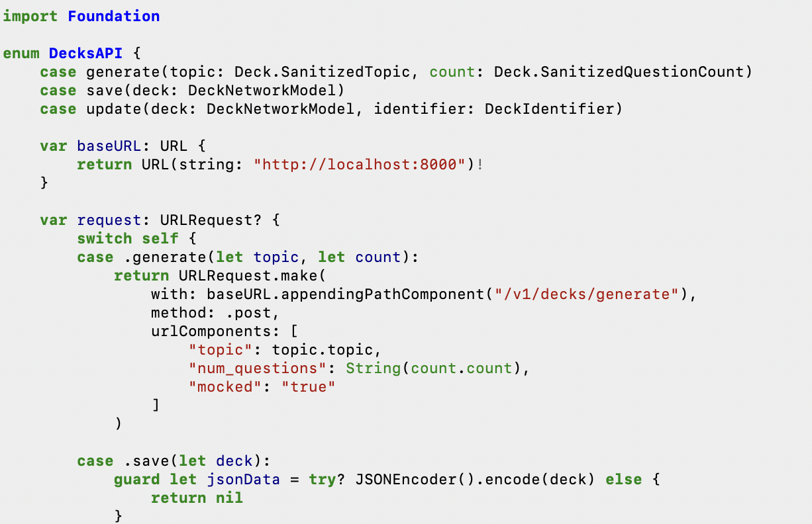
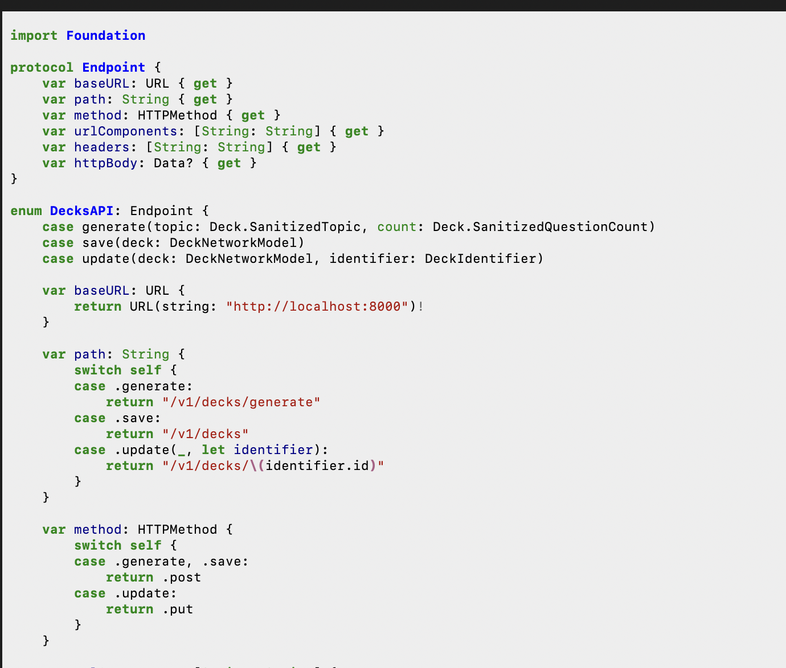
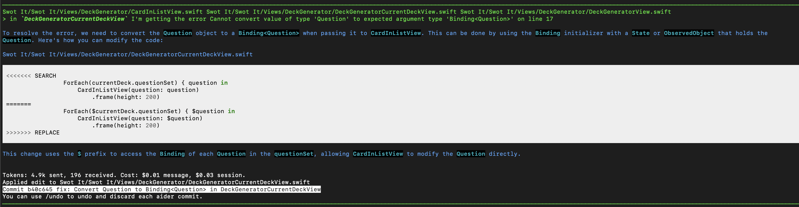
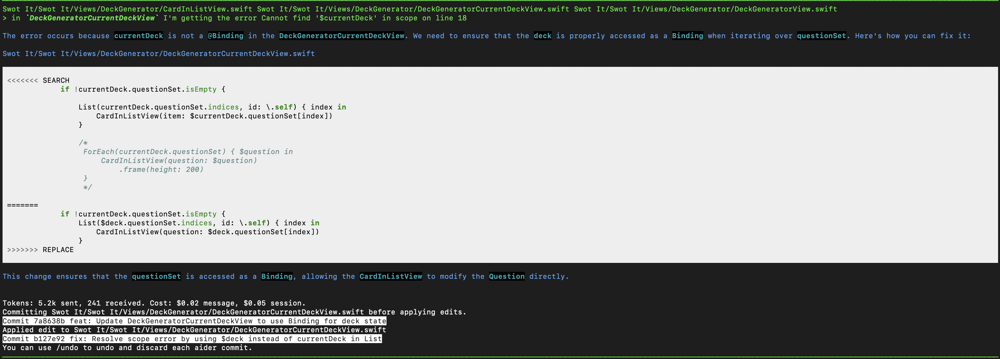

# About

In this post I continue the development of an iOS app to auto-generate flashcards putting the [aider-chat](https://aider.chat) command line AI assistant through it's paces.

[Aider-chat](https://aider.chat) is an open source and free command line tool allowing you to write / edit code using [most of the popular](https://aider.chat/docs/llms.html) LLMs available. It maps the structure of your repo, makes the requests to the LLM, and edits your source code providing a summary of the changes through the terminal.

One interesting aspect to Aider Chat is that it enables connection to a *local* LLM such as through [Ollama](https://ollama.com). This opens up the possibility (if your machine can handle it) of inferencing local LLMs to help with coding without any of the normal query costs such as using Open AI.

# Key Takeaways

One of the major benefits of Aider Chat is that it is a lot cheaper to run than other options there is no subscription required to Aider itself, instead you pay for your usage directly with the LLM host eg Open AI or Anthropic.

## Cost Versus Cursor

In this comparison I'm comparing Aider Chat configured with Open AI LLM = "gpt-4o" against Cursor's [Pro subscription](https://www.cursor.com/pricing) using premium requests using the same LLM "gpt-4o"

Model used: "gpt-4o"

|                            | Aider-Chat | Cursor |
| -------------------------- | ---------- | ------ |
| Cost per 100 queries       | $1.58      | $4.00  |
| Fast query limit per month | none       | 500    |

## Other Features of Aider
* Option to use local LLMs
* Can be used as part of other scripts: [Scripting](https://aider.chat/docs/scripting.html)
* Voice to code
* Auto-generates commits

## What works well

* As with many of the AI assisted tools I have tried, the results are best once you have a well designed solution in mind. If this is true, then the process of writing the code to implement the design can be made much more efficient.
* As described in the documentation, I found that the results improved if I went through the work flow of first `/ask`-ing aider to propose a solution, refining it in the terminal before `/code`ing the solution that we have refined together.

## What to watch out for

* The models seemed to struggle quite a bit with SwiftUI. This is not necessarily an issue with Aider Chat, but the prompts it uses under the hood may not help with this. In general even the best LLMs sometimes struggle with SwiftUI, however due to the way Aider Chat operates through the command line, I found it harder to query, test and then adapt my solution to debug the issue compared to IDE based assistants like Cursor.
* Automatic commits can make it harder to quickly see what's changed. Although it's a 'feature' of Aider Chat, I found the default mode of changing code and then immediately committing it actually quite annoying. Instead of working with the code until I found a solution I was happy with and then committing something that worked, I found myself having to step back through commits and then rework the solution before committing again. The good news for me at least is that the auto commit feature can be switched off.

# Use Cases Deep-Dive

Firstly, I want to briefly mention the use-cases I'm *not* going to discuss in detail, they worked pretty well and are not that interesting to read about. As with many LLM based coding assistants aider-chat excels in implementing clear, concise coding tasks. For example: 
* Unit testing a class with simple logic and using Dependency Injection
* Making a new SwiftUI View with clear UI requirements
* Abstracting interfaces behind a protocol
* Creating 'composite' / 'decorator' helper classes to compose protocol based function implementations

What I hope is more interesting, is to look at more complex development tasks that in my experience actually take up the majority of my time when writing software. Thankfully I don't spend hours and hours each day writing repetitive simple code, and the below examples involve more in-depth modifications.

## Refactoring a Network Layer

For my implementation of a networking layer I had built a `DecodingNetworkLayer`, to send a `URLRequest` and return a decoded result. Taking inspiration from this [swift-networking](https://github.com/danthorpe/swift-networking) library from Dan Thorpe, I built up my network stack implementation using 'Modifiers', allowing me to build a composable networking stack that can both share common traits and be easily extended for different scenarios such as authenticated requests.

So far so good...

However, my implementation of 'DecksAPIClient' (A CRUD interface for Deck Objects) used a 'DecksAPI' (struct) to return a URLRequest object that I could then send to my network stack. The API struct was not injected, but created within the Client making it hard to test and extend, and also required a hard-coded 'baseURL' when initialised making it difficult to swap between environments.



I wanted to de-couple the responsibilities of the various parts of this implementation to allow the functionality to be extended without modifying existing implementations (open-closed principle). In the end I want my API Client to be injected with:
* 'Something' to create an *authenticated* network layer that can execute a `URLRequest`
* 'Something' to convert a Endpoint (enum) definition into a `URLRequest`

By providing these dependencies, how these pieces are constructed can be extended later without modifying the Client for example if I want to add logging to record client side errors to the stack.

### Prompts with Aider:

First breaking that struct into an Endpoint representation

``` 
/ask I want to represent my DecksAPi endpoint as an enum with each available endpoint 
represented as a case with associated values what would this look like for the functions 
defined in DecksAPI? 
```



This still has issues for me however, the 'request' function on the DecksAPI looks functional, but how would I extend this? I'd have to modify it directly. Also the URLRequest.make function is repeated for every case.

I refined this further with:

```
/ask instead of the enum DecksAPI having a func 'request' to return the URLRequest, 
I want DecksAPI to implement a protocol 'Endpoint' that has read-only properties to 
return all the requirements to make the URLRequest. The construction should be done by another entity 
```

Which got a lot closer:



But I still didn't like that hard-coded ```baseURL```:

```
/ask I want the base URL to be provided to the RequestBuilder through a closure 
that returns an optional URL, also make the buildRequest function an instance function 
not a static function
```

Then to update the APIClient and make some more modifications:

```
/ask I want DecksAPIClient to be constructed with an implementation of RequestBuilding 
and use this to create the request used in its functions 

> the `RequestBuilder` class should be extended to implement `RequestBuilding` 
change the constructor of this class to require an implementation of `BaseURLProvider`, and use this in the `buildRequest` function  

> move the `RequestBuilder` class into its own file  

> make a new class called LocalHostURLProvider that implements BaseURLProvider returning 'http://localhost:8000' as the baseURL 

> update `AppLaunchFactory` using `RequestBuilder` to provide the implementation of `requestBuilder` to the `NetworkDecksAPIClient`  

> move the `RequestBuilder` class into its own file 
```

### Finished code

#### Factory

```swift
func makeDecksAPIClient(identity: Identity) -> DecksAPIClient {
        func makeDecksAPIClient(identity: Identity) -> DecksAPIClient {
        let baseNetworking = JSONDecodingNetworkLayer(
            wrapping: URLSessionNetworkLayer()
        )
        
        let requestBuilder = RequestBuilder(baseURLProvider: LocalHostURLProvider())
        let authenticatedNetworking = RequestBuilderDecodingEndpointNetwork(
            requestBuilder: requestBuilder,
            networkLayer: baseNetworking
                .addIdentity(identity)
        )
        return NetworkDecksAPIClient { authenticatedNetworking }
    }
```

#### API Client
```swift
class NetworkDecksAPIClient: DecksAPIClient {
    
    let authenticatedNetworking: () -> DecodingEndpointNetwork
    
    init(_ authenticatedNetworking: @escaping () -> DecodingEndpointNetwork) {
        self.authenticatedNetworking = authenticatedNetworking
    }
    
    func loadDecks() async -> Result<[APISavedDeckSummary], LoadableResourceError> {
        return await authenticatedNetworking()
            .send(
                DecksAPI.loadDecks,
                decodeTo: [DecksAPI.DeckListNetworkModel].self
            )
            .map(
                successMap: { deckNetworkModels in
                    deckNetworkModels.map { deckListNetworkModel in
                            .init(
                                apiId: deckListNetworkModel.id,
                                topic: deckListNetworkModel.topic
                            )
                    }
                },
                errorMap: { $0.mapToDomain() }
            )
    }
```

#### Endpoint-Decoding Network Layer (top level)


```swift
protocol DecodingEndpointNetwork {
    func send<T: Decodable>(_ endpoint: Endpoint, decodeTo type: T.Type) async -> Result<T, NetworkIntegrationError>
}

class RequestBuilderDecodingEndpointNetwork: DecodingEndpointNetwork {
    private let requestBuilder: RequestBuilding
    private let networkLayer: DecodingNetworkLayer

    init(requestBuilder: RequestBuilding, networkLayer: DecodingNetworkLayer) {
        self.requestBuilder = requestBuilder
        self.networkLayer = networkLayer
    }

    func send<T: Decodable>(_ endpoint: Endpoint, decodeTo type: T.Type) async -> Result<T, NetworkIntegrationError> {
        guard let request = requestBuilder.buildRequest(from: endpoint) else {
            return .failure(.badURL)
        }
        
        return await networkLayer.send(request, decodeTo: type)
    }
}
```

#### Endpoint
```swift
enum DecksAPI: Endpoint {
    case generate(topic: APISavedDeck.SanitizedTopic, count: APISavedDeck.SanitizedQuestionCount)
    case loadDecks
    case save(deck: DeckNetworkModel)
    case loadDeck(id: String)
    case update(deck: DeckNetworkModel, identifier: DeckIdentifier)
    
    var path: String {
        switch self {
        case .generate:
            return "/v1/decks/generate"
        // etc
    }
    
    var method: HTTPMethod { // etc }
    var urlComponents: [String: String] { // etc }
```

The point of going through this is not to talk about Network Layer architecture, but to understand if an AI assistant can help with these sort of tasks. Overall I found for this task that aider-chat was a really useful assistant, I was clear about the task I wanted to achieve, and the tool really helped me to speed up the process of making these changes. I timed myself making these changes and it was under 30mins, I think by hand, I would have taken at least 1 hour to make these changes.

Total time taken: ~ 30 mins. Cost: $0.33

## Fixing Swift UI Binding Error

In this example I was struggling with how to approach a SwiftUI Binding Where the underlying model is not a primitive type, but is an `enum` with different cases.

A simplified version of the problem is shown below:

```swift
struct ExampleDetailView: View {
    
    enum LoadableResource<R: Equatable>: Equatable {
        case loading
        case loaded(R)
        case error(LoadableResourceError)
    }
    
    struct APISavedDeck: Equatable {
        var topic: String
        var questionSet: [Question]
    }
    
    @State private var openDeck: LoadableResource<APISavedDeck>

    var body: some View {
        switch openDeck {
        case .loading:
            ProgressView("Loading...")
        case .loaded(let currentDeck):
            // This requires a Binding<[Questions]>, but how to bind that to my LoadableResource?
            EditableQuestionsListView(questions: /* ???? */)
            
        case .error(let error):
            Text("Error: \(error.localizedDescription)")
                .foregroundColor(.red)
        }
    }
}
```
I wanted Aider chat to help architect a solution to solve this problem of how to make a binding that I can provide to my `EditableQuestionsListView`. Please note the examples below are from the original problem which looked a bit different to above.

The 2 solutions proposed didn't fix the problem at all:

Fix 1: 


Fix 2: 


In both cases, Aider essentially just added a `$` sign to the point where I wanted the Binding, it failed to recognise that the underlying type was the issue.

What worked (if you're wondering) was to use a custom Binding:

```swift
case .loaded(let currentDeck):
            let questionsBinding = Binding(
                get: { currentDeck.questionSet },
                set: {
                    openDeck = .loaded(
                        .init(
                            topic: currentDeck.topic,
                            questionSet: $0
                        )
                    )
                }
            )
            
            EditableQuestionsListView(questions: questionsBinding)
```

## Using Voice Mode

The Voice mode was one of the features I was most excited about exploring with Aider. However, when I came to use it I discovered two things:
* Using voice mode on Aider chat costs money, it passes the audio input to an LLM to interpret the audio data back into text. It costs, and it is a bit slow.
* If you're using a Mac, dictating text from speech is a simple as pressing F5, which is free and I found worked better than Aider's voice mode! I've been using F5 to write my prompts (and my blog posts) ever since.

## Configuration

One of the nice things about Aider is that it supports per-project [configuration and environment settings](https://aider.chat/docs/config.html). This is really useful if you  need different setttings per-project, for example ifd you want a higher powered LLM for SwiftUI code, but can use cheaper models for simpler projects like writing those productivity python scripts!